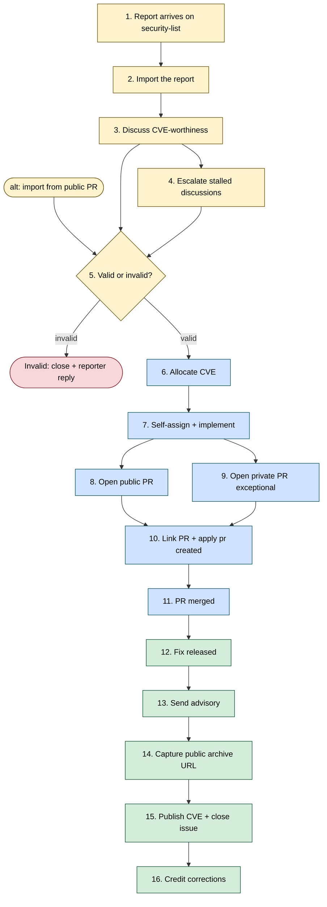
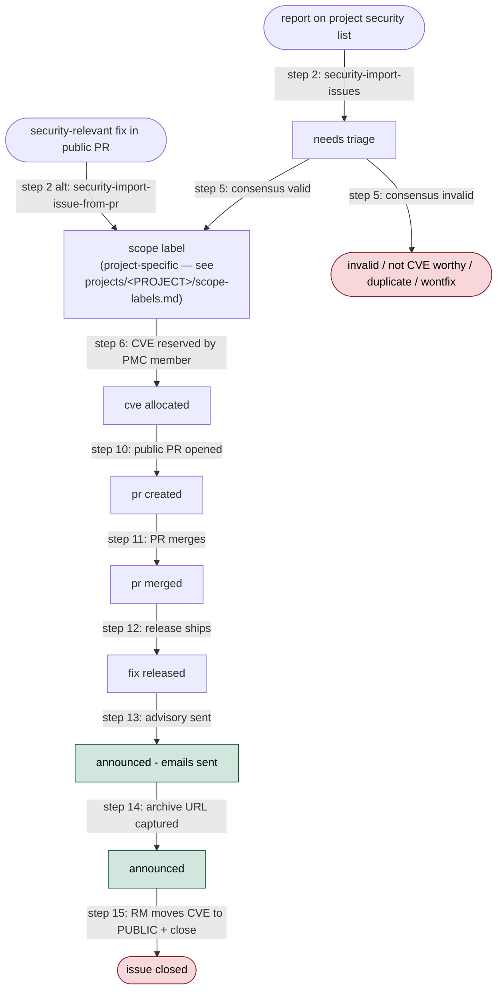

<!-- START doctoc generated TOC please keep comment here to allow auto update -->
<!-- DON'T EDIT THIS SECTION, INSTEAD RE-RUN doctoc TO UPDATE -->
**Table of Contents**  *generated with [DocToc](https://github.com/thlorenz/doctoc)*

- [Overview](#overview)
- [Who this guide is for](#who-this-guide-is-for)
- [Prerequisites for running the agent skills](#prerequisites-for-running-the-agent-skills)
  - [1. An agent that speaks the `SKILL.md` convention](#1-an-agent-that-speaks-the-skillmd-convention)
  - [2. Email connection (Gmail MCP, today)](#2-email-connection-gmail-mcp-today)
  - [3. GitHub connection (GitHub MCP / `gh` CLI)](#3-github-connection-github-mcp--gh-cli)
  - [4. PMC membership (only for CVE allocation)](#4-pmc-membership-only-for-cve-allocation)
  - [5. Browser (for the human-click steps)](#5-browser-for-the-human-click-steps)
  - [6. Local `<upstream>` clone (only for `security-fix-issue`)](#6-local-upstream-clone-only-for-security-fix-issue)
  - [7. `uv` (for `generate-cve-json`)](#7-uv-for-generate-cve-json)
- [Shared conventions](#shared-conventions)
  - [Keeping the reporter informed](#keeping-the-reporter-informed)
  - [Recording status transitions on the tracker](#recording-status-transitions-on-the-tracker)
  - [Confidentiality](#confidentiality)
- [Skills](#skills)
  - [Setup](#setup)
  - [Security workflow](#security-workflow)
  - [PR triage and review](#pr-triage-and-review)
- [For issue triagers — Steps 1–6](#for-issue-triagers--steps-16)
  - [Daily triage loop](#daily-triage-loop)
  - [Assessing a report](#assessing-a-report)
  - [Allocating the CVE](#allocating-the-cve)
  - [Tools you use most](#tools-you-use-most)
- [For remediation developers — Steps 7–11](#for-remediation-developers--steps-711)
  - [Picking up a tracker](#picking-up-a-tracker)
  - [Attempting an automated fix](#attempting-an-automated-fix)
  - [Opening the public fix PR manually](#opening-the-public-fix-pr-manually)
  - [Private-PR fallback](#private-pr-fallback)
  - [Handoff to the release manager](#handoff-to-the-release-manager)
  - [Tools you use most](#tools-you-use-most-1)
- [For release managers — Steps 12–15](#for-release-managers--steps-1215)
  - [Handoff from the remediation developer](#handoff-from-the-remediation-developer)
  - [Sending the advisory](#sending-the-advisory)
  - [Capturing the public archive URL](#capturing-the-public-archive-url)
  - [Publishing the CVE and closing the issue](#publishing-the-cve-and-closing-the-issue)
  - [Post-release credit corrections](#post-release-credit-corrections)
  - [Tools you use most](#tools-you-use-most-2)
- [Process reference: the 16 steps](#process-reference-the-16-steps)
  - [Step 1 — Report arrives on security@](#step-1--report-arrives-on-security)
  - [Step 2 — Import the report](#step-2--import-the-report)
  - [Step 3 — Discuss CVE-worthiness](#step-3--discuss-cve-worthiness)
  - [Step 4 — Escalate stalled discussions](#step-4--escalate-stalled-discussions)
  - [Step 5 — Land the valid/invalid consensus](#step-5--land-the-validinvalid-consensus)
  - [Step 6 — Allocate the CVE](#step-6--allocate-the-cve)
  - [Step 7 — Self-assign and implement the fix](#step-7--self-assign-and-implement-the-fix)
  - [Step 8 — Open a public PR (straightforward cases)](#step-8--open-a-public-pr-straightforward-cases)
  - [Step 9 — Open a private PR (exceptional cases)](#step-9--open-a-private-pr-exceptional-cases)
  - [Step 10 — Link the PR and apply `pr created`](#step-10--link-the-pr-and-apply-pr-created)
  - [Step 11 — PR merged](#step-11--pr-merged)
  - [Step 12 — Fix released](#step-12--fix-released)
  - [Step 13 — Send the advisory](#step-13--send-the-advisory)
  - [Step 14 — Capture the public advisory URL](#step-14--capture-the-public-advisory-url)
  - [Step 15 — Publish the CVE record and close the issue](#step-15--publish-the-cve-record-and-close-the-issue)
  - [Step 16 — Credit corrections](#step-16--credit-corrections)
- [Label lifecycle](#label-lifecycle)
  - [State diagram](#state-diagram)
  - [Label reference](#label-reference)
- [Adopting the framework](#adopting-the-framework)

<!-- END doctoc generated TOC please keep comment here to allow auto update -->

## Overview

This repository hosts a reusable, project-agnostic framework for
running an ASF project's security-issue handling process. (Currently
served from `apache/airflow-steward` for legacy reasons; future-
renamed to `apache/steward`.) The
lifecycle and conventions below are framework-level; everything
project-specific (identity, repositories, mailing lists, canned
responses, release trains, security model, scope labels, milestone
formats, title-normalisation rules, fix-workflow specifics) is
declared in the **adopting project's** `<project-config>/`
directory — i.e. the `.apache-steward/` directory the adopting
project keeps at the root of its tracker repository. The framework
itself is pulled into the adopter's tracker as a git submodule at
`.apache-steward/apache-steward/`.

A new project adopts the framework by:

1. Cloning this repository as a submodule of its tracker repo at
   `.apache-steward/apache-steward/`.
2. Copying the [`projects/_template/`](projects/_template/)
   scaffold into the tracker's `.apache-steward/` directory and
   filling in the project's identity, mailing lists, scope labels,
   release-train roster, security model, and canned responses.
3. Symlinking `.claude/skills/` in the tracker repo to the
   submodule's `.claude/skills/` so Claude Code (or another
   `SKILL.md`-aware agent) loads the framework's skills against the
   adopter's project configuration.

The private `<tracker>` repository is the adopting project's security
team's shared tracker. Only members of the security team have access.
Issues are created from reports raised on the project's security
mailing list (see `<project-config>/project.md → Mailing lists`)
and copied into `<tracker>` by security-team members — the GitHub
author of a tracker is therefore **not always the reporter**, and
the real reporter is whoever sent the original email.

Every tracker flows through two channels at the same time:

- the original security-list mail thread, where the reporter is
  kept informed at every status transition;
- a comment on the tracking issue, so the rest of the security team and the
  release manager can follow along without reconstructing state from labels
  and timestamps.

The rest of this document is organised by audience. Pick the role that matches
what you are about to do, read its section, and jump into the
[process reference](#process-reference-the-16-steps) when you need the
step-level detail.

## Who this guide is for

Three roles share the handling process. Any security-team member can take on
any of them for a given issue, and in practice people rotate — but at any
moment a given tracking issue has exactly one person who owns the next move.

Pick whichever applies to you now:

- **I am new to the security team, or I mostly just want to comment on
  issues.** Read [Shared conventions](#shared-conventions) below. The
  adopting project's security-issues board — see
  `<project-config>/project.md → GitHub project board` — is the main
  view. You do not need an agent for commenting.
- **I am a rotational triager** — running `import new reports` and
  `sync all` a few times a week. Jump to
  [For issue triagers — Steps 1–6](#for-issue-triagers--steps-16).
- **I picked up a tracker and am about to open a fix PR.** Jump to
  [For remediation developers — Steps 7–11](#for-remediation-developers--steps-711).
- **I am the release manager for a cut containing a security fix.** Jump to
  [For release managers — Steps 12–15](#for-release-managers--steps-1215).
- **I am looking up a specific step or label.** Go straight to
  [Process reference](#process-reference-the-16-steps) or
  [Label lifecycle](#label-lifecycle).

## Prerequisites for running the agent skills

If you only plan to **comment on issues** from the board, skip this
section — a browser and your `<tracker>` collaborator access are
enough.

If you plan to **run any of the agent skills** (`import`, `sync`,
`security-allocate-cve`, `fix`, `generate-cve-json`, `deduplicate`) — typically
as a rotational triager, remediation developer, or release manager —
check the following setup **before** invoking a skill. Each skill also
runs a short Step 0 pre-flight against the same list and stops with a
clear message if something is missing, so you do not discover a
missing piece half-way through a workflow.

### 1. An agent that speaks the `SKILL.md` convention

[Claude Code](https://www.anthropic.com/claude-code) is the reference
implementation the skills are written against. Any agent that reads
the `.claude/skills/*/SKILL.md` files and follows their step-by-step
instructions should work; there is no hard dependency on Claude Code
specifically.

The agent runs against pre-disclosure CVE content (private mail
threads, draft advisories, in-flight tracker discussions). Run it
with the credential-isolation setup documented in
[`secure-agent-setup.md`](secure-agent-setup.md) — a layered
defence built around Claude Code's filesystem sandbox, tool-level
permission rules, and a clean-env wrapper that strips credential-
shaped variables from the agent's environment. The required system
tools (`bubblewrap`, `socat`, `claude-code` itself) are pinned with
a 7-day upstream-release cooldown, mirroring the same convention the
framework uses for its `[tool.uv] exclude-newer` and Dependabot
configs.

### 2. Email connection (Gmail MCP, today)

The import, sync, and security-allocate-cve skills **read the security-list
mail thread** associated with each tracker and draft replies on that
thread. Today this goes through the
[Claude Gmail MCP](https://docs.anthropic.com/en/docs/build-with-claude/mcp)
connected to the personal Gmail account of a security-team member
who is subscribed to the adopting project's security list (see
`<project-config>/project.md → Mailing lists`). That is enough
access for the skills to see inbound reports and create drafts on
the right threads.

There is an ASF-wide alternative on the horizon:
[`rbowen/ponymail-mcp`](https://github.com/rbowen/ponymail-mcp) (by
Rich Bowen, former ASF board director and ComDev lead) now supports
OAuth authentication and can read private ASF lists. Once ASF OAuth
is wired in, individual triagers should be able to run the skills
without connecting their personal Gmail — authenticating directly
against ASF credentials (and, eventually, the ASF's new MFA) will be
sufficient. Until then, Gmail MCP is the way.

**Without this connection:** `security-import-issues` cannot find new
reports, `security-sync-issues` cannot reconcile status with the mail
thread, and no skill can draft replies to reporters. The skills will
refuse to start and tell you to configure the MCP first.

### 3. GitHub connection (GitHub MCP / `gh` CLI)

Every skill reads and writes `<tracker>` issues. Claude Code ships
with the GitHub MCP by default, and the skills also use the `gh`
CLI directly for some calls. What the skills need:

- Authenticated `gh auth status` on the shell the agent runs in.
- Collaborator access (any permission level) on `<tracker>` — the
  security-team roster is maintained per-project; for the active
  project see
  [`<project-config>/release-trains.md`](<project-config>/release-trains.md#security-team-roster).
- For `security-fix-issue`: a fork of `<upstream>` on your GitHub
  account (the skill pushes a branch there before opening the PR
  via `gh pr create --web`).

### 4. PMC membership (only for CVE allocation)

The adopting project's CVE-tool allocation form is **PMC-gated** on
the server side — only the project's PMC members can submit a CVE
allocation. Non-PMC triagers can still run `security-allocate-cve`; the
skill detects this up front (it asks *"are you a PMC member of
`<PROJECT>`?"*) and produces a relay message for a PMC member to
click through instead. For Airflow the concrete tool is ASF's
Vulnogram at <https://cveprocess.apache.org/allocatecve>; see
[`<project-config>/project.md → CVE tooling`](<project-config>/project.md#cve-tooling).

The same PMC gate applies to ponymail URL lookups on private ASF
lists; until `ponymail-mcp` is wired in with ASF OAuth, only PMC
members can see private-list archives directly.

### 5. Browser (for the human-click steps)

Several parts of the process involve a form a human has to fill in
and click — the CVE-tool allocation form, the CVE record `#source`
paste, the `gh pr create --web` compose view. The skills prepare
the URL and the exact text to paste and hand it off to the browser;
they do not try to automate those clicks.

### 6. Local `<upstream>` clone (only for `security-fix-issue`)

The fix skill writes the change in your local clone, runs local
checks and tests, pushes a branch to your fork, and opens a PR via
`gh pr create --web`. You need:

- a clean clone of `<upstream>` reachable from the agent's working
  directory — the path comes from `config/user.md →
  environment.upstream_clone`, set interactively the first time
  you run the skill;
- the adopting project's dev toolchain installed per its contributing
  docs — for Airflow see
  [`<project-config>/fix-workflow.md → Toolchain`](<project-config>/fix-workflow.md#toolchain);
- a remote named for your GitHub fork that `gh pr create` can push
  to.

### 7. `uv` (for `generate-cve-json`)

The `generate-cve-json` script is a small `uv`-managed Python
project. Install `uv` once
(<https://github.com/astral-sh/uv>); the script bootstraps the
rest.

## Shared conventions

These conventions bind every role. If you are unsure whether a rule applies to
you, it does.

### Keeping the reporter informed

The security team commits to keeping the original reporter informed about the
state of their report **at every status transition**, on the original mail
thread (not on the GitHub-notifications mirror thread). A short status update
should be sent to the reporter whenever any of the following happens:

* the report has been acknowledged or assessed (valid / invalid);
* a CVE has been allocated;
* a fix PR has been opened;
* a fix PR has been **merged**;
* the issue has been scheduled for a specific release (milestone set);
* the release has shipped and the public advisory has been sent;
* the CVE record has been published on cve.org (completes the disclosure);
* any credits or fields visible in the eventual public advisory have changed.

Each status update should plainly state what has changed, link to the relevant
artifact (PR URL, CVE ID, advisory link), and state what comes next. If the
reporter has not yet replied with their preferred credit, ask the
credit-preference question — but **do not re-ask it if it has already been
asked** on the same thread and is still awaiting a reply. Pinging the reporter
twice about the same open question is rude and gets us blocklisted; default to
the reporter's full name from the original email if they do not respond
before publication.

Reusable wording for the common cases lives in
[`<project-config>/canned-responses.md`](<project-config>/canned-responses.md) — consult it before drafting a
reply from scratch.

### Recording status transitions on the tracker

**Every status transition must also be recorded as a comment on the GitHub
issue in `<tracker>`**, not only sent by email. The two channels
serve different audiences: the email keeps the reporter informed; the issue
comment keeps the rest of the security team and the release manager informed
without forcing them to reconstruct the state from labels and timestamps. The
comment should briefly state what changed, link to the artifact (PR URL, CVE
ID, advisory link), and indicate whether the reporter has been notified.

### Confidentiality

Confidentiality of the private tracker (`<tracker>` for the
adopting project) is both a **lifecycle rule** and a **writing rule**:
every transition you record on a tracker, every status comment, every
email draft has to respect it. The full rule set — forbidden surfaces,
allowed surfaces, scrubbing guidance, the exception buckets for private
`security@` / `private@` threads and in-repo `gh issue comment` calls —
lives in
[`AGENTS.md` — Confidentiality of the tracker repository](AGENTS.md#confidentiality-of-the-tracker-repository).
Read it before editing anything that might be seen outside the team.

## Skills

The framework's skills are flat folders under
[`.claude/skills/`](.claude/skills/) — each skill's `SKILL.md` is the
authoritative process documentation. Skills are named with a category
prefix so the function is visible at a glance:

### Setup

First-time install of the secure-agent setup, ongoing verification,
and framework-lifecycle housekeeping.

| Skill | Purpose |
|---|---|
| [`setup-secure-config`](.claude/skills/setup-secure-config/SKILL.md) | First-time install of the secure agent setup. |
| [`setup-verify-secure-config`](.claude/skills/setup-verify-secure-config/SKILL.md) | Verify the secure setup landed correctly. |
| [`setup-update-secure-config`](.claude/skills/setup-update-secure-config/SKILL.md) | Surface drift between the installed setup and the framework's latest. |
| [`setup-upgrade-steward`](.claude/skills/setup-upgrade-steward/SKILL.md) | Pull the framework checkout to latest `origin/main`. |
| [`setup-verify-steward`](.claude/skills/setup-verify-steward/SKILL.md) | Verify the framework is integrated correctly into an adopter tracker. |
| [`setup-sync-shared-config`](.claude/skills/setup-sync-shared-config/SKILL.md) | Commit + push the user's shared Claude config to its sync repo. |

### Security workflow

The 16-step lifecycle for security-issue handling — from
`<security-list>` import through CVE publication. See
[Process reference](#process-reference-the-16-steps) below for the
cross-skill flow as a diagram.

| Skill | Purpose |
|---|---|
| [`security-import-issues`](.claude/skills/security-import-issues/SKILL.md) | Import new reports from `<security-list>` into `<tracker>`. |
| [`security-import-issue-from-pr`](.claude/skills/security-import-issue-from-pr/SKILL.md) | Open a tracker for a security-relevant fix opened as a public PR. |
| [`security-import-issues-from-md`](.claude/skills/security-import-issues-from-md/SKILL.md) | Bulk-import findings from a markdown report. |
| [`security-sync-issues`](.claude/skills/security-sync-issues/SKILL.md) | Reconcile a tracker against its mail thread, fix PR, release train, and archives. |
| [`security-allocate-cve`](.claude/skills/security-allocate-cve/SKILL.md) | Allocate a CVE for a tracker (Vulnogram URL + paste-ready JSON). |
| [`security-fix-issue`](.claude/skills/security-fix-issue/SKILL.md) | Implement the fix as a public PR in `<upstream>`. |
| [`security-deduplicate-issues`](.claude/skills/security-deduplicate-issues/SKILL.md) | Merge two trackers describing the same root-cause vulnerability. |
| [`security-invalidate-issue`](.claude/skills/security-invalidate-issue/SKILL.md) | Close a tracker as invalid with a polite-but-firm reporter reply. |

### PR triage and review

*Coming in a follow-up PR.* The `pr-*` skill family (`pr-triage`,
`pr-stats`, `pr-maintainer-review`) is being lifted from
`apache/airflow` into this framework — see
[Adopting the framework](#adopting-the-framework) for the
abstraction model that keeps project-specific knobs
(maintainer roster, CI-check → doc URL map, label conventions) in
the adopter's `<project-config>/`.

## For issue triagers — Steps 1–6

You own the tracker from an inbound report on `<security-list>`
through to a CVE allocated, a scope label applied, and the issue ready for a
remediation developer to pick up. Step 6 (the CVE allocation itself) is
PMC-gated: **only the adopting project's PMC members can submit the
CVE-tool allocation form**. If you are not on the PMC you relay a
pre-drafted request to a PMC
member — either way you are the one who lands the resulting CVE ID back into
the tracker.

### Daily triage loop

A typical triage sweep runs three skills in order:

1. **`import new reports`** —
   [`security-import-issues`](.claude/skills/security-import-issues/SKILL.md)
   scans `<security-list>` for threads not yet imported,
   classifies each candidate (real report vs. automated-scan / consolidated /
   media / spam), and proposes a tracker per valid report plus a
   receipt-of-confirmation Gmail draft. See
   [Step 2](#step-2--import-the-report).
2. **`sync all`** —
   [`security-sync-issues`](.claude/skills/security-sync-issues/SKILL.md)
   reconciles every open tracker against its mail thread, the fix PR, the
   release train, and the users@ archive. Proposes label / milestone /
   assignee / body changes in one pass.
3. **`allocate CVE for issue #N`** —
   [`security-allocate-cve`](.claude/skills/security-allocate-cve/SKILL.md) when a report has
   been assessed as valid. See [Step 6](#step-6--allocate-the-cve).

Nothing is applied without an explicit confirmation — each skill is a
proposal engine, not an auto-pilot.

### Assessing a report

For each `needs triage` tracker, drive the validity assessment in comments,
pulling at least one other security-team member into the discussion. Use the
canned-response templates from [`<project-config>/canned-responses.md`](<project-config>/canned-responses.md)
for negative assessments so the tone stays polite-but-firm.

When the report is confirmed valid, apply exactly one scope label from
the project's scope set (declared in
[`<project-config>/scope-labels.md`](<project-config>/scope-labels.md)).
If a report affects more than one scope, split into per-scope trackers
before allocation — the `security-sync-issues` skill surfaces this as
a blocker. See
[Step 5](#step-5--land-the-validinvalid-consensus).

If discussion stalls for about 30 days, escalate to a broader audience per
[Step 4](#step-4--escalate-stalled-discussions).

### Allocating the CVE

Use [`security-allocate-cve`](.claude/skills/security-allocate-cve/SKILL.md). The skill asks up
front whether you are on the PMC; if not, it reshapes the recipe into an
``@``-mention relay message you forward to a PMC member on the tracker or on
the `<security-list>` thread. Once the allocated `CVE-YYYY-NNNNN`
is pasted back, the skill wires it into the tracker in one pass (the *CVE
tool link* body field, the `cve allocated` label, a status-change comment, a
refreshed CVE-JSON attachment) and hands off to `security-sync-issues` to
reconcile the rest of the tracker. See [Step 6](#step-6--allocate-the-cve)
for the full detail.

### Tools you use most

- [`security-import-issues`](.claude/skills/security-import-issues/SKILL.md) —
  *"import new reports"* at the start of each triage sweep. The entry point
  into the process for `<security-list>` reports.
- [`security-import-issue-from-pr`](.claude/skills/security-import-issue-from-pr/SKILL.md) —
  *"import a tracker from PR <N>"* when a security-relevant fix landed
  publicly without going through `<security-list>` and the team has agreed
  it warrants a CVE. Lands directly in the `Assessed` column.
- [`security-sync-issues`](.claude/skills/security-sync-issues/SKILL.md) —
  *"sync <issue-ref>"* or *"sync all"*. Surfaces stalled issues, missing
  fields, credit replies, and scope-split requirements in one combined
  proposal.
- [`security-allocate-cve`](.claude/skills/security-allocate-cve/SKILL.md) — *"allocate a CVE
  for <issue-ref>"*.
- [`generate-cve-json`](tools/vulnogram/generate-cve-json/SKILL.md) — to
  refresh the paste-ready JSON embedded in the issue body on demand.
- [`security-deduplicate-issues`](.claude/skills/security-deduplicate-issues/SKILL.md) —
  when two trackers describe the same root-cause bug discovered
  independently.
- [`security-invalidate-issue`](.claude/skills/security-invalidate-issue/SKILL.md) —
  *"close NN as invalid"* once Step 5 lands a consensus-invalid
  decision. Applies the `invalid` label, archives the project-board
  item, and (for `<security-list>`-imported trackers) drafts a reply
  to the reporter explaining the reasoning.

## For remediation developers — Steps 7–11

You own the tracker from a CVE allocated to a merged public fix PR in
`<upstream>` (including the `pr merged` hand-off where the tracker sits
waiting for the release train to ship). The role name matches the
`remediation developer` credit you receive in the published CVE record (see
`credits[]` with `type: "remediation developer"` in the generated CVE JSON).

### Picking up a tracker

Pick a tracker that has a scope label, `cve allocated`, and clear consensus
on the fix shape. Self-assign yourself on GitHub so the board reflects
ownership. See [Step 7](#step-7--self-assign-and-implement-the-fix).

### Attempting an automated fix

Before writing the fix by hand, consider letting the
[`security-fix-issue`](.claude/skills/security-fix-issue/SKILL.md) skill try
it first. Invoked as *"try to fix issue #N"* (or *"draft a PR for #N"*), the
skill:

- runs `security-sync-issues` first to make sure the tracker's state is
  current;
- reads the full tracker discussion and the linked `security@` mail
  thread and decides whether the issue is *easily fixable* — clear
  consensus on the fix shape, small scope, known location in
  `<upstream>`. If it is not, the skill stops and tells you what
  more the tracker needs before it is safe to attempt;
- if it is, proposes an implementation plan (which file(s) to touch,
  what to change, what tests to add) and **waits for your explicit
  confirmation** before making any edits;
- writes the change in your local `<upstream>` clone, runs the
  local static checks and tests, and iterates on failures;
- opens the public PR from your fork via `gh pr create --web` with a
  scrubbed title and body — every public surface (commit message,
  branch name, PR title, PR body, newsfragment) is grep-checked for
  `CVE-`, the `<tracker>` repo slug, `vulnerability`, *"security fix"*
  and similar leakage before being written or pushed;
- updates the `<tracker>` tracking issue with the new PR
  link and applies the `pr created` label, handing back off to
  `security-sync-issues`.

The skill refuses to proceed in cases where a human decision still
needs to happen: reports that are still being assessed, reports not
yet classified as valid vulnerabilities, and changes that require the
private-PR fallback in
[Step 9](#step-9--open-a-private-pr-exceptional-cases). If it refuses,
fall back to the manual flow below.

Even when the skill succeeds end-to-end, you remain the PR's author
and reviewer-facing contact on the public `<upstream>` PR. Stay
on the PR through review and merge.

### Opening the public fix PR manually

If you are writing the fix by hand, write the code change in your local
`<upstream>` clone, run the local checks and tests, and open the PR
via `gh pr create --web`. The PR description **must not** reveal the CVE,
the security nature of the change, or link back to `<tracker>` —
see [Step 8](#step-8--open-a-public-pr-straightforward-cases) and the
confidentiality rules in
[`AGENTS.md`](AGENTS.md#confidentiality-of-the-tracker-repository).

Request a `backport-to-v3-2-test` (or equivalent) label on the public PR
when the fix should ship on a patch train.

### Private-PR fallback

In exceptional cases — highly critical fixes, or code that needs private
review — open the PR against the `main` branch of `<tracker>`
instead of `<upstream>`. CI does not run there, so run static checks and
tests manually before asking for review. Once approved, re-open the PR in
`<upstream>` by pushing the branch public. See
[Step 9](#step-9--open-a-private-pr-exceptional-cases).

### Handoff to the release manager

Once the `<upstream>` PR merges, `security-sync-issues` moves the tracker
from `pr created` to `pr merged` and sets the milestone of the release the
fix will ship in. The tracker then waits for the release train. When the
release ships, sync swaps `pr merged` → `fix released` and the tracker
becomes the release manager's responsibility. See
[Step 11](#step-11--pr-merged) and [Step 12](#step-12--fix-released).

### Tools you use most

- [`security-fix-issue`](.claude/skills/security-fix-issue/SKILL.md) —
  *"try to fix issue #N"*. Proposes a plan, writes the code, runs local
  tests, and opens a `--web` PR with a scrubbed title/body. See
  [Attempting an automated fix](#attempting-an-automated-fix) above for
  the full flow and the cases where the skill refuses to proceed.
- [`security-sync-issues`](.claude/skills/security-sync-issues/SKILL.md) — to
  keep the tracker's labels, milestone, and assignee aligned with the PR
  state as it moves through review and merge.

## For release managers — Steps 12–15

You own the tracker from the moment the fix actually ships (`fix released`)
to a closed tracking issue with a PUBLISHED CVE record. The hand-off from
the remediation developer is automatic: `security-sync-issues` detects the
milestone version on PyPI / the Helm registry, swaps `pr merged` →
`fix released`, and assigns the advisory-send to you.

### Handoff from the remediation developer

Watch your `fix released` queue on the board. Until the `pr merged` →
`fix released` swap fires, the tracker is still the remediation developer's
(Step 11 territory). Once it fires, it is yours. See
[Step 12](#step-12--fix-released).

### Sending the advisory

Review the attached CVE JSON on the tracker, fill any missing body fields
(CWE, severity, affected versions), and send the advisory emails to
`<announce-list>` / `<users-list>` from the ASF CVE tool.
Add `announced - emails sent` and remove `fix released`. **Do not close the
issue yet** — see [Step 13](#step-13--send-the-advisory).

### Capturing the public archive URL

This is a handoff the sync skill handles for you: once the advisory has
been archived on the users@ list, the next `security-sync-issues` run finds
the URL, populates the *Public advisory URL* body field, regenerates the
CVE JSON attachment, and moves the label to `announced`. See
[Step 14](#step-14--capture-the-public-advisory-url).

### Publishing the CVE and closing the issue

For every `announced` issue: open Vulnogram at
`https://cveprocess.apache.org/cve5/<CVE-ID>#source`, paste the latest
attached CVE JSON, save, and move the record from REVIEW to PUBLIC.
Then close the issue (do not update any labels). This is the terminal
step of the lifecycle. See
[Step 15](#step-15--publish-the-cve-record-and-close-the-issue).

An issue that sits on `announced` for more than a day or two
is a signal to ping the RM.

### Post-release credit corrections

If credits need correction after announcement, respond to the announcement
emails with the missing credits, update the ASF CVE tool, and ask the ASF
security team to push the information to `cve.org`. See
[Step 16](#step-16--credit-corrections).

### Tools you use most

- [`security-sync-issues`](.claude/skills/security-sync-issues/SKILL.md) —
  *"sync announced"* at the start of each release window, to
  see the `announced` backlog needing a Vulnogram push. Also
  *"sync CVE-YYYY-NNNN"* to drill into one specific CVE before sending the
  advisory.
- [`generate-cve-json`](tools/vulnogram/generate-cve-json/SKILL.md) — to
  regenerate the attachment on demand when a body field changes after the
  URL has been captured.

## Process reference: the 16 steps

This is the authoritative outline of the 16-step lifecycle. Each step
links to the skill or document that owns the deep mechanics — the
brief descriptions below are an overview, not a substitute for the
linked skill's `SKILL.md`. If the role sections above conflict with
what is here, this reference wins.



Colour key: yellow = triager (Steps 1–5), blue = remediation
developer (Steps 6–11), green = release manager (Steps 12–16),
red = terminal close.

### Step 1 — Report arrives on security@

The reporter sends the issue to the adopting project's
`<security-list>` (or to `security@apache.org`, which forwards to the
project list).

### Step 2 — Import the report

[`security-import-issues`](.claude/skills/security-import-issues/SKILL.md)
scans `<security-list>` for un-imported threads, classifies each
candidate (real / automated-scan / consolidated / spam), extracts the
issue-template fields from the root message, and proposes one tracker
per valid report plus a Gmail receipt-of-confirmation draft. Nothing
is applied without explicit confirmation. The newly-created tracker
lands with `needs triage`.

If the report matches a known-invalid pattern, the skill drafts the
matching canned reply from
[`<project-config>/canned-responses.md`](<project-config>/canned-responses.md)
and does **not** create a tracker — invalid noise never enters the
board.

**Alternate entry — fix already opened as a public PR.** Use
[`security-import-issue-from-pr`](.claude/skills/security-import-issue-from-pr/SKILL.md).
The tracker lands directly in the `Assessed` column with the scope
label applied (validity already decided informally), so Step 5 is
skipped and the tracker is ready for `security-allocate-cve`
immediately.

**Alternate entry — bulk import from markdown.** Use
[`security-import-issues-from-md`](.claude/skills/security-import-issues-from-md/SKILL.md)
when triaging the output of an AI security review or third-party
scanner. Each finding becomes one tracker.

### Step 3 — Discuss CVE-worthiness

Drive the validity assessment in tracker comments. Pull at least
one other security-team member into the discussion. Use canned
responses from
[`<project-config>/canned-responses.md`](<project-config>/canned-responses.md)
for negative assessments so the tone stays polite-but-firm.

### Step 4 — Escalate stalled discussions

If discussion stalls for ~30 days, escalate in **two phases**:

* **Phase 1 — short call for ideas.** A 3-4-paragraph message that
  states the report exists and asks the wider audience for input.
  No AI analysis, no proposed fixes — phase 1 is deliberately bare so
  domain experts can weigh in with novel ideas without being anchored
  to a pre-baked solution.
* **Phase 2 — AI-generated design-space analysis.** Triggered if
  phase 1 stays silent for ~7 more days. The agent drafts a
  structured analysis (TL;DR, why-the-obvious-fix-is-insufficient,
  options A/B/C with trade-offs, open design questions, tagged
  reviewers per a documented selection methodology). The triager
  reviews and approves before posting.

Audiences are the same for both phases: `<private-list>`,
`security@apache.org`, the original reporter. Both phases land as
rollup entries on the tracker (per
[`tools/github/status-rollup.md`](tools/github/status-rollup.md))
with the action label `Sync (Step 4 escalation)`.

### Step 5 — Land the valid/invalid consensus

If valid, apply exactly one scope label from
[`<project-config>/scope-labels.md`](<project-config>/scope-labels.md);
remove `needs triage`. If invalid,
[`security-invalidate-issue`](.claude/skills/security-invalidate-issue/SKILL.md)
labels `invalid`, posts a closing comment, archives the board item,
and (for `<security-list>`-imported trackers) drafts a polite-but-firm
reporter reply. If consensus cannot be reached, follow
[ASF voting](https://www.apache.org/foundation/voting.html#apache-voting-process)
on `<security-list>`.

If a candidate duplicate is detected,
[`security-deduplicate-issues`](.claude/skills/security-deduplicate-issues/SKILL.md)
merges two trackers in place — preserving every reporter's credit,
every mailing-list thread reference, and every independent
attack-vector description. The kept issue's body is updated, the
duplicate is closed with the `duplicate` label, and the CVE JSON
attachment is regenerated so both finders land in `credits[]`.

### Step 6 — Allocate the CVE

[`security-allocate-cve`](.claude/skills/security-allocate-cve/SKILL.md)
opens the project's CVE allocation tool (for Airflow, ASF Vulnogram
at <https://cveprocess.apache.org/allocatecve>; in general see
[`<project-config>/project.md → CVE tooling`](<project-config>/project.md#cve-tooling)),
normalises the title per
[`<project-config>/title-normalization.md`](<project-config>/title-normalization.md),
and — if the triager isn't on the PMC — builds an `@`-mention relay
message for a PMC member. Once the allocated `CVE-YYYY-NNNNN` is
pasted back, the skill wires it into the tracker (CVE tool link
body field, `cve allocated` label, status-change comment, refreshed
CVE-JSON attachment) and hands off to `security-sync-issues` to
reconcile the rest.

### Step 7 — Self-assign and implement the fix

A security team member self-assigns and implements the fix.
Optional automation:
[`security-fix-issue`](.claude/skills/security-fix-issue/SKILL.md)
proposes an implementation plan, writes the change in your local
`<upstream>` clone, runs local tests, and opens a public PR via
`gh pr create --web` with a scrubbed title + body. Every public
surface (commit message, branch name, PR title, PR body, newsfragment)
is grep-checked for `CVE-`, the `<tracker>` slug, *"vulnerability"*,
*"security fix"*, and similar leakage before being written or pushed.

The skill refuses to proceed for reports still being assessed,
reports not yet classified as valid, and changes that require the
private-PR fallback (Step 9). Even when it succeeds end-to-end, you
remain the PR's author and reviewer-facing contact — stay on the PR
through review and merge.

Delegation to a trusted third-party individual is permitted under
LAZY CONSENSUS, sharing only the information required to implement
the fix.

### Step 8 — Open a public PR (straightforward cases)

The PR description **must not** reveal the CVE, the security nature
of the change, or link back to `<tracker>`. See
[`AGENTS.md → Confidentiality`](AGENTS.md#confidentiality-of-the-tracker-repository).
Request the appropriate `backport-to-vN-N-test` label on the public
PR when the fix should ship on a patch train.

### Step 9 — Open a private PR (exceptional cases)

For highly critical fixes or code that needs private review, open
the PR against `<tracker>`'s `main` branch first (not the
`tracker_default_branch` set in `<project-config>/project.md`). CI
does not run there — run static checks + tests manually. Once
approved, push the branch to `<upstream>` and re-open the PR there.

### Step 10 — Link the PR and apply `pr created`

The remediation developer links the PR in the tracker description
and applies `pr created` on `<tracker>`.

### Step 11 — PR merged

When the `<upstream>` PR merges, swap `pr created` → `pr merged`
and set the milestone of the release the fix will ship in (per
[`<project-config>/milestones.md`](<project-config>/milestones.md)).
Close any private variant in `<tracker>`. The tracker waits at
`pr merged` until the release ships — this can be hours (fast core
patches) or weeks (provider waves on a fixed cadence).

### Step 12 — Fix released

When the release containing the fix ships to users (PyPI / Helm
registry / equivalent),
[`security-sync-issues`](.claude/skills/security-sync-issues/SKILL.md)
detects the release version on the next run and proposes the
`pr merged` → `fix released` swap, which is the hand-off cue from
remediation developer to release manager. The same pass proposes
posting a one-shot **release-manager hand-off comment** with a
numbered checklist (Steps 13–15 from the RM's perspective) and
links to the paste-ready CVE JSON, the Vulnogram `#source` and
`#email` tabs, and canned-response templates.

### Step 13 — Send the advisory

The release manager fills the remaining CVE fields:

* CWE — see [cwe.mitre.org](https://cwe.mitre.org/data/index.html);
* affected versions (`0, < <version released>`);
* short public summary;
* severity score per the
  [ASF severity rating](https://security.apache.org/blog/severityrating)
  (lazy consensus during discussion; voting if there's disagreement;
  RM has the final say to keep the announcement on schedule);
* references — `patch` PR URL on `<upstream>`;
* credits — `reporter`, `remediation developer`.

The RM generates the description, sets the CVE to REVIEW (then
READY), and sends the announcement emails from the project's CVE
tool. Apply `announced - emails sent`, remove `fix released`. **The
issue stays open** at this point — it closes only at Step 15.

### Step 14 — Capture the public advisory URL

Once the announcement is archived on the users@ list, the next
`security-sync-issues` run finds the URL, populates the *Public
advisory URL* body field (a dedicated field on the issue template —
never reuse the *"Security mailing list thread"* field), regenerates
the CVE JSON attachment (now carrying a `vendor-advisory` reference),
and adds the `announced` label. The same pass proposes a one-shot
**publication-ready notification comment** for the release manager.

Until *Public advisory URL* is populated, the sync skill will not
propose `announced` — publishing a CVE with an empty
`vendor-advisory` reference would leak a broken record into
`cve.org`.

### Step 15 — Publish the CVE record and close the issue

The release manager opens the project's CVE tool's `#source` view at
`https://cveprocess.apache.org/cve5/<CVE-ID>#source`, copies the
latest CVE JSON attachment from the tracker (the one regenerated in
Step 14), pastes it into the form, saves, and moves the record from
READY to PUBLIC — propagating to [`cve.org`](https://cve.org). Then
closes the tracker (no label updates). `security-sync-issues`
follows the close with an `archiveProjectV2Item` mutation so the
closed tracker leaves the active board (see
[`tools/github/project-board.md` — *Archive a board item*](tools/github/project-board.md#archive-a-board-item--terminal-state-cleanup)).

A tracker that sits on `announced` for more than a day or two is a
signal to ping the RM.

### Step 16 — Credit corrections

If credits need correction post-announcement, the release manager:

* responds to the announcement emails with the missing credits;
* updates the project's CVE tool with the missing credits;
* asks the ASF security team to push the information to
  [`cve.org`](https://cve.org).

## Label lifecycle

### State diagram

The diagram below shows the typical state flow. Each node is a label (or a
cluster of labels that co-exist); each edge is a process step that moves
the issue forward. Closing dispositions (`invalid`, `not CVE worthy`,
`duplicate`, `wontfix`) can terminate the flow at any point after
`needs triage`.



The dashed-equivalent entry from `A2` represents the deliberate-import
path described in [Step 2](#step-2--import-the-report) above:
trackers opened from a public PR skip the `needs triage` column and
land directly at `scope label` (the `Assessed` column on the project
board) because the validity assessment has already happened
informally before invocation.

### Label reference

The table below repeats the same flow in tabular form. An issue typically
moves through these labels left-to-right.

**Scope labels are project-specific** — the adopting project's concrete
scope labels live in
[`<project-config>/scope-labels.md`](projects/) (for the currently
adopting project, [`<project-config>/scope-labels.md`](<project-config>/scope-labels.md)).
The table below uses `<scope>` as a placeholder for whichever scope
labels the adopting project defines.

| Label | Meaning | Added at step | Removed at step |
| --- | --- | --- | --- |
| `needs triage` | Freshly filed; assessment not yet started. | 1 | 5 |
| `<scope>` | Scope of the vulnerability. Exactly one project-specific scope label is set. | 5 | never (sticks for the lifetime of the issue) |
| `cve allocated` | A CVE has been reserved for the issue. Allocation itself is PMC-gated (only the adopting project's PMC members can submit the CVE-tool allocation form); a non-PMC triager relays a request to a PMC member via the [`security-allocate-cve`](.claude/skills/security-allocate-cve/SKILL.md) skill. | 6 | never |
| `pr created` | A public fix PR has been opened on `<upstream>` but has not yet merged. | 10 | 11 (replaced by `pr merged`) |
| `pr merged` | The fix PR has merged into `<upstream>`; no release with the fix has shipped yet. | 11 | 12 (replaced by `fix released` when the release ships) |
| `fix released` | A release containing the fix has shipped to users; advisory has not been sent yet. | 12 | 13 (replaced by `announced - emails sent`) |
| `announced - emails sent` | The public advisory has been sent to the project's announce and users mailing lists (see `<project-config>/project.md → Mailing lists`). The issue **stays open** after this label is applied; closing is gated on the RM completing Step 15. | 13 | never (stays on the issue after closing for audit history) |
| `announced` | The public advisory URL has been captured in the tracking issue's *Public advisory URL* body field and the attached CVE JSON has been regenerated so its `references[]` now carries the `vendor-advisory` URL. The tracking issue is waiting for the release manager to copy the CVE JSON into the project's CVE tool, move the record to PUBLIC, and close the issue (Step 15). No label changes at close — the issue closes with `announced` still set. | 14 | never (stays on the issue after closing) |
| `wontfix` / `invalid` / `not CVE worthy` / `duplicate` | Closing dispositions for reports that are not valid or not CVE-worthy. | 5 / 6 | — |

The [`security-sync-issues`](.claude/skills/security-sync-issues/SKILL.md)
skill keeps these labels honest: on every run it detects the current state
of the issue, the fix PR, and the release train, and proposes the label
transitions the process requires.

## Adopting the framework

Projects don't live in this repository — adopters pull the framework
into their own tracker repo as a git submodule (see *Repository
purpose* in [`AGENTS.md`](AGENTS.md#repository-purpose)) and ship
their per-project configuration alongside it under
`<project-config>/` (which resolves to `.apache-steward/` in the
adopter's tracker root).

To bootstrap a new adopter, copy [`projects/_template/`](projects/_template/)
into `<project-config>/` in your tracker repo, fill in the TODO
placeholders, and point the framework's skills at it via the path
resolution documented in
[`AGENTS.md` — Placeholder convention](AGENTS.md#placeholder-convention-used-in-skill-files).

**Always run `git submodule update --init --recursive` after every
pull on the tracker repository.** A plain `git pull` on the tracker
advances the framework submodule *pointer* in the index but does
**not** update the framework's working tree — skills will run
against the version of the framework checked out on disk, which is
the *previous* version after any pull that bumped the submodule
pointer. Wire it into a post-merge hook to make it automatic:

```bash
# In the adopter tracker repo, one-time setup:
cat >.git/hooks/post-merge <<'SH'
#!/bin/sh
exec git submodule update --init --recursive
SH
chmod +x .git/hooks/post-merge
```

The framework's `setup-upgrade-steward` skill (in this repo's
[`.claude/skills/setup-upgrade-steward/SKILL.md`](.claude/skills/setup-upgrade-steward/SKILL.md))
upgrades the framework checkout itself; if the user is consuming
the framework as a tracker submodule, the skill reminds them to
follow up with submodule update on the parent tracker.
