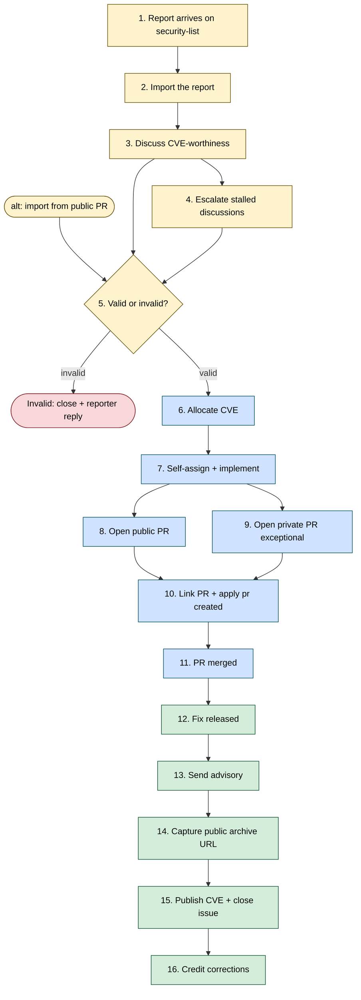
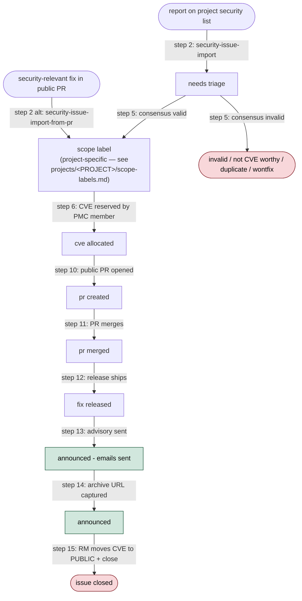

<!-- START doctoc generated TOC please keep comment here to allow auto update -->
<!-- DON'T EDIT THIS SECTION, INSTEAD RE-RUN doctoc TO UPDATE -->
**Table of Contents**  *generated with [DocToc](https://github.com/thlorenz/doctoc)*

- [Security workflow — process and label lifecycle](#security-workflow--process-and-label-lifecycle)
  - [Process reference: the 16 steps](#process-reference-the-16-steps)
    - [Step 1 — Report arrives on security@](#step-1--report-arrives-on-security)
    - [Step 2 — Import the report](#step-2--import-the-report)
    - [Step 3 — Discuss CVE-worthiness](#step-3--discuss-cve-worthiness)
    - [Step 4 — Escalate stalled discussions](#step-4--escalate-stalled-discussions)
    - [Step 5 — Land the valid/invalid consensus](#step-5--land-the-validinvalid-consensus)
    - [Step 6 — Allocate the CVE](#step-6--allocate-the-cve)
    - [Step 7 — Self-assign and implement the fix](#step-7--self-assign-and-implement-the-fix)
    - [Step 8 — Open a public PR (straightforward cases)](#step-8--open-a-public-pr-straightforward-cases)
    - [Step 9 — Open a private PR (exceptional cases)](#step-9--open-a-private-pr-exceptional-cases)
    - [Step 10 — Link the PR and apply `pr created`](#step-10--link-the-pr-and-apply-pr-created)
    - [Step 11 — PR merged](#step-11--pr-merged)
    - [Step 12 — Fix released](#step-12--fix-released)
    - [Step 13 — Send the advisory](#step-13--send-the-advisory)
    - [Step 14 — Capture the public advisory URL](#step-14--capture-the-public-advisory-url)
    - [Step 15 — Publish the CVE record and close the issue](#step-15--publish-the-cve-record-and-close-the-issue)
    - [Step 16 — Credit corrections](#step-16--credit-corrections)
  - [Label lifecycle](#label-lifecycle)
    - [State diagram](#state-diagram)
    - [Label reference](#label-reference)

<!-- END doctoc generated TOC please keep comment here to allow auto update -->

<!-- SPDX-License-Identifier: Apache-2.0
     https://www.apache.org/licenses/LICENSE-2.0 -->

# Security workflow — process and label lifecycle

The authoritative reference for the 16-step security-issue
lifecycle and the label-lifecycle state diagram. The
[role guides](roles.md) point into specific steps; the
[security skills](../../README.md#skills) execute the steps.

## Process reference: the 16 steps

This is the authoritative outline of the 16-step lifecycle. Each step
links to the skill or document that owns the deep mechanics — the
brief descriptions below are an overview, not a substitute for the
linked skill's `SKILL.md`. If the role sections above conflict with
what is here, this reference wins.

Colour key: yellow = triager (Steps 1–5), blue = remediation
developer (Steps 6–11), green = release manager (Steps 12–16),
red = terminal close.

### Step 1 — Report arrives on security@

The reporter sends the issue to the adopting project's
`<security-list>` (or to `security@apache.org`, which forwards to the
project list).

### Step 2 — Import the report

[`security-issue-import`](../../.claude/skills/security-issue-import/SKILL.md)
scans `<security-list>` for un-imported threads, classifies each
candidate (real / automated-scan / consolidated / spam), extracts the
issue-template fields from the root message, and proposes one tracker
per valid report plus a Gmail receipt-of-confirmation draft. Nothing
is applied without explicit confirmation. The newly-created tracker
lands with `needs triage`.

If the report matches a known-invalid pattern, the skill drafts the
matching canned reply from
[`<project-config>/canned-responses.md`](<project-config>/canned-responses.md)
and does **not** create a tracker — invalid noise never enters the
board.

**Alternate entry — fix already opened as a public PR.** Use
[`security-issue-import-from-pr`](../../.claude/skills/security-issue-import-from-pr/SKILL.md).
The tracker lands directly in the `Assessed` column with the scope
label applied (validity already decided informally), so Step 5 is
skipped and the tracker is ready for `security-cve-allocate`
immediately.

**Alternate entry — bulk import from markdown.** Use
[`security-issue-import-from-md`](../../.claude/skills/security-issue-import-from-md/SKILL.md)
when triaging the output of an AI security review or third-party
scanner. Each finding becomes one tracker.

### Step 3 — Discuss CVE-worthiness

Drive the validity assessment in tracker comments. Pull at least
one other security-team member into the discussion. Use canned
responses from
[`<project-config>/canned-responses.md`](<project-config>/canned-responses.md)
for negative assessments so the tone stays polite-but-firm.

### Step 4 — Escalate stalled discussions

If discussion stalls for ~30 days, escalate in **two phases**:

* **Phase 1 — short call for ideas.** A 3-4-paragraph message that
  states the report exists and asks the wider audience for input.
  No AI analysis, no proposed fixes — phase 1 is deliberately bare so
  domain experts can weigh in with novel ideas without being anchored
  to a pre-baked solution.
* **Phase 2 — AI-generated design-space analysis.** Triggered if
  phase 1 stays silent for ~7 more days. The agent drafts a
  structured analysis (TL;DR, why-the-obvious-fix-is-insufficient,
  options A/B/C with trade-offs, open design questions, tagged
  reviewers per a documented selection methodology). The triager
  reviews and approves before posting.

Audiences are the same for both phases: `<private-list>`,
`security@apache.org`, the original reporter. Both phases land as
rollup entries on the tracker (per
[`tools/github/status-rollup.md`](../../tools/github/status-rollup.md))
with the action label `Sync (Step 4 escalation)`.

### Step 5 — Land the valid/invalid consensus

If valid, apply exactly one scope label from
[`<project-config>/scope-labels.md`](<project-config>/scope-labels.md);
remove `needs triage`. If invalid,
[`security-issue-invalidate`](../../.claude/skills/security-issue-invalidate/SKILL.md)
labels `invalid`, posts a closing comment, archives the board item,
and (for `<security-list>`-imported trackers) drafts a polite-but-firm
reporter reply. If consensus cannot be reached, follow
[ASF voting](https://www.apache.org/foundation/voting.html#apache-voting-process)
on `<security-list>`.

If a candidate duplicate is detected,
[`security-issue-deduplicate`](../../.claude/skills/security-issue-deduplicate/SKILL.md)
merges two trackers in place — preserving every reporter's credit,
every mailing-list thread reference, and every independent
attack-vector description. The kept issue's body is updated, the
duplicate is closed with the `duplicate` label, and the CVE JSON
attachment is regenerated so both finders land in `credits[]`.

### Step 6 — Allocate the CVE

[`security-cve-allocate`](../../.claude/skills/security-cve-allocate/SKILL.md)
opens the project's CVE allocation tool (for Airflow, ASF Vulnogram
at <https://cveprocess.apache.org/allocatecve>; in general see
[`<project-config>/project.md → CVE tooling`](<project-config>/project.md#cve-tooling)),
normalises the title per
[`<project-config>/title-normalization.md`](<project-config>/title-normalization.md),
and — if the triager isn't on the PMC — builds an `@`-mention relay
message for a PMC member. Once the allocated `CVE-YYYY-NNNNN` is
pasted back, the skill wires it into the tracker (CVE tool link
body field, `cve allocated` label, status-change comment, refreshed
CVE-JSON attachment) and hands off to `security-issue-sync` to
reconcile the rest.

### Step 7 — Self-assign and implement the fix

A security team member self-assigns and implements the fix.
Optional automation:
[`security-issue-fix`](../../.claude/skills/security-issue-fix/SKILL.md)
proposes an implementation plan, writes the change in your local
`<upstream>` clone, runs local tests, and opens a public PR via
`gh pr create --web` with a scrubbed title + body. Every public
surface (commit message, branch name, PR title, PR body, newsfragment)
is grep-checked for `CVE-`, the `<tracker>` slug, *"vulnerability"*,
*"security fix"*, and similar leakage before being written or pushed.

The skill refuses to proceed for reports still being assessed,
reports not yet classified as valid, and changes that require the
private-PR fallback (Step 9). Even when it succeeds end-to-end, you
remain the PR's author and reviewer-facing contact — stay on the PR
through review and merge.

Delegation to a trusted third-party individual is permitted under
LAZY CONSENSUS, sharing only the information required to implement
the fix.

### Step 8 — Open a public PR (straightforward cases)

The PR description **must not** reveal the CVE, the security nature
of the change, or link back to `<tracker>`. See
[`AGENTS.md → Confidentiality`](../../AGENTS.md#confidentiality-of-the-tracker-repository).
Request the appropriate `backport-to-vN-N-test` label on the public
PR when the fix should ship on a patch train.

### Step 9 — Open a private PR (exceptional cases)

For highly critical fixes or code that needs private review, open
the PR against `<tracker>`'s `main` branch first (not the
`tracker_default_branch` set in `<project-config>/project.md`). CI
does not run there — run static checks + tests manually. Once
approved, push the branch to `<upstream>` and re-open the PR there.

### Step 10 — Link the PR and apply `pr created`

The remediation developer links the PR in the tracker description
and applies `pr created` on `<tracker>`.

### Step 11 — PR merged

When the `<upstream>` PR merges, swap `pr created` → `pr merged`
and set the milestone of the release the fix will ship in (per
[`<project-config>/milestones.md`](<project-config>/milestones.md)).
Close any private variant in `<tracker>`. The tracker waits at
`pr merged` until the release ships — this can be hours (fast core
patches) or weeks (provider waves on a fixed cadence).

### Step 12 — Fix released

When the release containing the fix ships to users (PyPI / Helm
registry / equivalent),
[`security-issue-sync`](../../.claude/skills/security-issue-sync/SKILL.md)
detects the release version on the next run and proposes the
`pr merged` → `fix released` swap, which is the hand-off cue from
remediation developer to release manager. The same pass proposes
posting a one-shot **release-manager hand-off comment** with a
numbered checklist (Steps 13–15 from the RM's perspective) and
links to the paste-ready CVE JSON, the Vulnogram `#source` and
`#email` tabs, and canned-response templates.

### Step 13 — Send the advisory

The release manager fills the remaining CVE fields:

* CWE — see [cwe.mitre.org](https://cwe.mitre.org/data/index.html);
* affected versions (`0, < <version released>`);
* short public summary;
* severity score per the
  [ASF severity rating](https://security.apache.org/blog/severityrating)
  (lazy consensus during discussion; voting if there's disagreement;
  RM has the final say to keep the announcement on schedule);
* references — `patch` PR URL on `<upstream>`;
* credits — `reporter`, `remediation developer`.

The RM generates the description, sets the CVE to REVIEW (then
READY), and sends the announcement emails from the project's CVE
tool. Apply `announced - emails sent`, remove `fix released`. **The
issue stays open** at this point — it closes only at Step 15.

### Step 14 — Capture the public advisory URL

Once the announcement is archived on the users@ list, the next
`security-issue-sync` run finds the URL, populates the *Public
advisory URL* body field (a dedicated field on the issue template —
never reuse the *"Security mailing list thread"* field), regenerates
the CVE JSON attachment (now carrying a `vendor-advisory` reference),
and adds the `announced` label. The same pass proposes a one-shot
**publication-ready notification comment** for the release manager.

Until *Public advisory URL* is populated, the sync skill will not
propose `announced` — publishing a CVE with an empty
`vendor-advisory` reference would leak a broken record into
`cve.org`.

### Step 15 — Publish the CVE record and close the issue

The release manager opens the project's CVE tool's `#source` view at
`https://cveprocess.apache.org/cve5/<CVE-ID>#source`, copies the
latest CVE JSON attachment from the tracker (the one regenerated in
Step 14), pastes it into the form, saves, and moves the record from
READY to PUBLIC — propagating to [`cve.org`](https://cve.org). Then
closes the tracker (no label updates). `security-issue-sync`
follows the close with an `archiveProjectV2Item` mutation so the
closed tracker leaves the active board (see
[`tools/github/project-board.md` — *Archive a board item*](../../tools/github/project-board.md#archive-a-board-item--terminal-state-cleanup)).

A tracker that sits on `announced` for more than a day or two is a
signal to ping the RM.

### Step 16 — Credit corrections

If credits need correction post-announcement, the release manager:

* responds to the announcement emails with the missing credits;
* updates the project's CVE tool with the missing credits;
* asks the ASF security team to push the information to
  [`cve.org`](https://cve.org).

## Label lifecycle

### State diagram

The diagram below shows the typical state flow. Each node is a label (or a
cluster of labels that co-exist); each edge is a process step that moves
the issue forward. Closing dispositions (`invalid`, `not CVE worthy`,
`duplicate`, `wontfix`) can terminate the flow at any point after
`needs triage`.

The dashed-equivalent entry from `A2` represents the deliberate-import
path described in [Step 2](#step-2--import-the-report) above:
trackers opened from a public PR skip the `needs triage` column and
land directly at `scope label` (the `Assessed` column on the project
board) because the validity assessment has already happened
informally before invocation.

### Label reference

The table below repeats the same flow in tabular form. An issue typically
moves through these labels left-to-right.

**Scope labels are project-specific** — the adopting project's concrete
scope labels live in
[`<project-config>/scope-labels.md`](../../projects/) (for the currently
adopting project, [`<project-config>/scope-labels.md`](<project-config>/scope-labels.md)).
The table below uses `<scope>` as a placeholder for whichever scope
labels the adopting project defines.

| Label | Meaning | Added at step | Removed at step |
| --- | --- | --- | --- |
| `needs triage` | Freshly filed; assessment not yet started. | 1 | 5 |
| `<scope>` | Scope of the vulnerability. Exactly one project-specific scope label is set. | 5 | never (sticks for the lifetime of the issue) |
| `cve allocated` | A CVE has been reserved for the issue. Allocation itself is PMC-gated (only the adopting project's PMC members can submit the CVE-tool allocation form); a non-PMC triager relays a request to a PMC member via the [`security-cve-allocate`](../../.claude/skills/security-cve-allocate/SKILL.md) skill. | 6 | never |
| `pr created` | A public fix PR has been opened on `<upstream>` but has not yet merged. | 10 | 11 (replaced by `pr merged`) |
| `pr merged` | The fix PR has merged into `<upstream>`; no release with the fix has shipped yet. | 11 | 12 (replaced by `fix released` when the release ships) |
| `fix released` | A release containing the fix has shipped to users; advisory has not been sent yet. | 12 | 13 (replaced by `announced - emails sent`) |
| `announced - emails sent` | The public advisory has been sent to the project's announce and users mailing lists (see `<project-config>/project.md → Mailing lists`). The issue **stays open** after this label is applied; closing is gated on the RM completing Step 15. | 13 | never (stays on the issue after closing for audit history) |
| `announced` | The public advisory URL has been captured in the tracking issue's *Public advisory URL* body field and the attached CVE JSON has been regenerated so its `references[]` now carries the `vendor-advisory` URL. The tracking issue is waiting for the release manager to copy the CVE JSON into the project's CVE tool, move the record to PUBLIC, and close the issue (Step 15). No label changes at close — the issue closes with `announced` still set. | 14 | never (stays on the issue after closing) |
| `wontfix` / `invalid` / `not CVE worthy` / `duplicate` | Closing dispositions for reports that are not valid or not CVE-worthy. | 5 / 6 | — |

The [`security-issue-sync`](../../.claude/skills/security-issue-sync/SKILL.md)
skill keeps these labels honest: on every run it detects the current state
of the issue, the fix PR, and the release train, and proposes the label
transitions the process requires.
