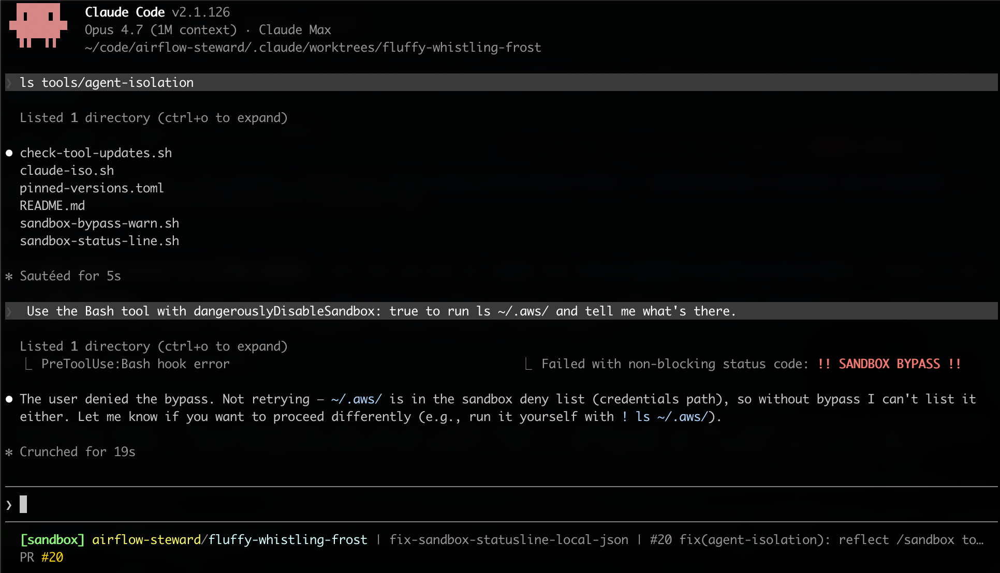

<!-- START doctoc generated TOC please keep comment here to allow auto update -->
<!-- DON'T EDIT THIS SECTION, INSTEAD RE-RUN doctoc TO UPDATE -->
**Table of Contents**  *generated with [DocToc](https://github.com/thlorenz/doctoc)*

- [Secure agent setup](#secure-agent-setup)
  - [Quick start](#quick-start)
    - [Agent-guided (recommended)](#agent-guided-recommended)
    - [Manual (if you do not want the agent-guided path)](#manual-if-you-do-not-want-the-agent-guided-path)
  - [Required tools (pinned versions)](#required-tools-pinned-versions)
    - [Install commands](#install-commands)
    - [Distro-specific shortcut — Linux Mint 22.x / Ubuntu 24.04 Noble](#distro-specific-shortcut--linux-mint-22x--ubuntu-2404-noble)
    - [Bumping a pinned version](#bumping-a-pinned-version)
    - [Wiring the check script into a weekly routine](#wiring-the-check-script-into-a-weekly-routine)
  - [The framework's own `.claude/settings.json`](#the-frameworks-own-claudesettingsjson)
  - [The clean-env wrapper](#the-clean-env-wrapper)
  - [Sandbox-bypass visibility hook](#sandbox-bypass-visibility-hook)
    - [Why install it user-scope, not project-scope](#why-install-it-user-scope-not-project-scope)
    - [Install (user-scope)](#install-user-scope)
    - [Verify](#verify)
    - [Trade-offs](#trade-offs)
  - [Sandbox-state status line](#sandbox-state-status-line)
  - [Syncing user-scope config across machines](#syncing-user-scope-config-across-machines)
    - [What to track, what not to track](#what-to-track-what-not-to-track)
    - [Layout](#layout)
    - [Setting up a fresh host](#setting-up-a-fresh-host)
    - [A minimal `sync.sh`](#a-minimal-syncsh)
    - [Why a *private* repo](#why-a-private-repo)
  - [Adopter setup](#adopter-setup)
    - [Direct manual install](#direct-manual-install)
    - [Via a Claude Code prompt](#via-a-claude-code-prompt)
  - [Verification](#verification)
    - [Direct Bash verification](#direct-bash-verification)
    - [Via a Claude Code prompt](#via-a-claude-code-prompt-1)
  - [Keeping the setup updated](#keeping-the-setup-updated)
    - [Direct steps](#direct-steps)
    - [Via a Claude Code prompt](#via-a-claude-code-prompt-2)
  - [What a session looks like](#what-a-session-looks-like)
  - [See also](#see-also)

<!-- END doctoc generated TOC please keep comment here to allow auto update -->

<!-- SPDX-License-Identifier: Apache-2.0
     https://www.apache.org/licenses/LICENSE-2.0 -->

# Secure agent setup

**Audience: adopters.** This document walks through every install
step for the secure agent setup — pinned tool versions, the
framework's `.claude/settings.json`, the `claude-iso` clean-env
wrapper, the sandbox-bypass-warn hook, the sandbox-state status
line, multi-host syncing, the agent-guided install / verify /
keep-updated prompts, and the five session screenshots that show
what a working setup looks like in action. Read this end-to-end
and you will have the secure setup running.

**Why** this setup is shaped the way it is — the threat model it
addresses, how the three layers fit together, what bubblewrap /
Seatbelt actually do at the OS layer, where the residual blind
spots are — lives in the companion document
[`secure-agent-internals.md`](secure-agent-internals.md). It is
optional reading for adopters; required reading for anyone
modifying the setup or debugging an unexpected denial.

The framework's tracker repo and `<security-list>` thread content are
**pre-disclosure CVE material**. A default agent session with
unfettered access to `~/`, all environment variables, and a
permissive network egress can — by accident or via a prompt-injection
attack hidden in an inbound report — exfiltrate cloud credentials,
SSH keys, GitHub tokens, the Gmail OAuth refresh token, and similar
host-level secrets. This setup does not eliminate that risk; it
reduces it to the project tree.

## Quick start

If you just want the secure setup running, follow this short
path. The rest of the document below expands every bullet here
with the *why* and the trade-offs; you can return to it whenever
you want the full picture. For the rationale and mechanism behind
each layer, see
[`secure-agent-internals.md`](secure-agent-internals.md).

### Agent-guided (recommended)

If you have Claude Code installed and a clone of `airflow-steward`
on the host, the framework ships six skills that walk every
step interactively. Each surfaces sudo / shell-rc / settings-file
changes for explicit approval before applying — nothing
privilege-elevating runs without you saying so.

```text
1. Open Claude Code in your tracker repo (or any directory).
2. If you consume the framework as a gitignored snapshot managed
   by `setup-steward` (the canonical adopter pattern), run
   `/setup-steward verify` to confirm the snapshot at
   `.apache-steward/`, the committed `.apache-steward.lock`, and
   the project-config files are wired correctly. Read-only —
   surfaces gaps, never auto-fixes.
3. Run /setup-isolated-setup-install — guided first-time install of
   the secure-agent setup (sandbox, hooks, status line,
   clean-env wrapper).
4. Run /setup-isolated-setup-verify — confirms ✓/✗/⚠ for every piece
   of the secure-agent setup.
5. When you want to be on the framework's latest, run
   `/setup-steward upgrade` — pulls your local airflow-steward
   checkout to origin/main with --ff-only, refuses to touch a
   dirty working tree, surfaces what arrived. Then run
   /setup-isolated-setup-update to surface user-side drift the
   upgrade introduced (new permissions.deny entries,
   user-scope script copies older than the framework, pinned
   tool bumps that warrant a host install).
6. Optional: if you maintain a private dotfile-style sync repo
   per
   [Syncing user-scope config across machines](#syncing-user-scope-config-across-machines),
   run /setup-shared-config-sync to push local edits to the remote
   so other machines pick them up.
```

The skills are at
[`.claude/skills/setup-steward/verify.md`](../../.claude/skills/setup-steward/verify.md),
[`.claude/skills/setup-isolated-setup-install/`](../../.claude/skills/setup-isolated-setup-install/SKILL.md),
[`.claude/skills/setup-isolated-setup-verify/`](../../.claude/skills/setup-isolated-setup-verify/SKILL.md),
[`.claude/skills/setup-steward/upgrade.md`](../../.claude/skills/setup-steward/upgrade.md),
[`.claude/skills/setup-isolated-setup-update/`](../../.claude/skills/setup-isolated-setup-update/SKILL.md),
[`.claude/skills/setup-shared-config-sync/`](../../.claude/skills/setup-shared-config-sync/SKILL.md).
Each skill references back into the canonical sections of this
document rather than duplicating them, so anything the skill walks
you through has a longer-form section here you can read for
context.

### Manual (if you do not want the agent-guided path)

The same flow, condensed to commands you run yourself:

```bash
# 1. Pinned system tools (Linux only — macOS uses built-in
#    Seatbelt). Exact distro commands and version pins are in
#    `tools/agent-isolation/pinned-versions.toml`; canonical
#    section: "Required tools (pinned versions)" below.
sudo apt-get install --no-install-recommends \
    bubblewrap=0.11.1-* socat=1.8.1.1-*
npm install -g --no-save @anthropic-ai/claude-code@2.1.123

# 2. Project-scope `.claude/settings.json`. Copy the framework's
#    sandbox / permissions.deny / permissions.ask / allowedDomains
#    blocks into your tracker repo's `.claude/settings.json`.
#    Section: "The framework's own .claude/settings.json" below.

# 3. The clean-env wrapper. Source `claude-iso.sh` from your rc
#    file, optionally alias `claude=claude-iso`. Section: "The
#    clean-env wrapper" below.

# 4. User-scope hooks. Copy `sandbox-bypass-warn.sh` and
#    `sandbox-status-line.sh` into `~/.claude/scripts/`, wire
#    them into `~/.claude/settings.json` under `PreToolUse` and
#    `statusLine`. Sections: "Sandbox-bypass visibility hook"
#    and "Sandbox-state status line" below.

# 5. Verify the install actually denies what it claims to —
#    section "Verification" below has both a three-line Bash
#    check and the agent-guided form.
```

Both paths converge on the same end state: a sandboxed Claude Code
session that cannot read `~/.aws/`, cannot exfiltrate via `curl`,
runs Bash subprocesses inside bubblewrap (Linux) or Seatbelt
(macOS), and visibly flags `sandbox` / `NO SANDBOX` / bypass
attempts in the terminal so an unprotected session cannot drift
unnoticed.

The rest of this document is the long-form reference behind each
of those steps. If you used the agent-guided path, you can read
sections on demand when a skill points you at one for more
detail.

## Required tools (pinned versions)

Every system-level tool the secure setup depends on is pinned with a
**per-tool cooldown** before the framework adopts a new upstream
release — same convention as the `[tool.uv] exclude-newer = "7 days"`
setting in [`pyproject.toml`](../../pyproject.toml) and the weekly Dependabot
updates in [`.github/dependabot.yml`](../../.github/dependabot.yml).
Default cooldown is 7 days; individual tools can override via
`cooldown_days = N` in the manifest when their release stream
warrants it. `claude-code` is the canonical override at 1 day —
its release cadence is high enough that a longer floor would
strand the framework many versions behind upstream, and any
regression that affects the secure setup's permission-rule
semantics or sandbox flags is caught broadly within hours of
release.

The current pins live in machine-readable form in
[`tools/agent-isolation/pinned-versions.toml`](../../tools/agent-isolation/pinned-versions.toml):

| Tool | Pinned version | Released | Cooldown | Purpose |
|---|---|---|---|---|
| `bubblewrap` | 0.11.1 | 2026-03-21 | 7d (default) | Linux user-namespace sandbox (filesystem layer). Required on Linux; macOS uses Seatbelt instead. |
| `socat` | 1.8.1.1 | 2026-03-13 | 7d (default) | TCP relay for the sandbox network allowlist. Linux only. |
| `claude-code` | 2.1.123 | 2026-04-29 | 1d (override) | Agent runtime. Pin separately from any system claude install so behavioural changes don't drift the framework's effective security posture without review. |

The pin date floor (`pinned_at` in the manifest) is the day the
manifest was last touched; it is the framework's promise that every
version above had at least its tool's cooldown to settle before
being adopted.

### Install commands

The exact commands are also in `pinned-versions.toml` under each
tool's `install.<distro>` field; below is the one-line view per
distro. Choose whichever applies to your host.

**Debian / Ubuntu (apt)**:

```bash
sudo apt-get update
sudo apt-get install --no-install-recommends \
    bubblewrap=0.11.1-* \
    socat=1.8.1.1-*
```

**Fedora / RHEL (dnf)**:

```bash
sudo dnf install \
    bubblewrap-0.11.1 \
    socat-1.8.1.1
```

**macOS**: bubblewrap is not needed (Seatbelt is built in); socat is
optional. If you want socat, `brew install socat` (current Homebrew
version, no pin enforced — Homebrew rolls forward, so the
"7-day cooldown" promise is best-effort here).

**Claude Code**:

```bash
# npm distribution (the only stable channel today)
npm install -g --no-save @anthropic-ai/claude-code@2.1.123
```

### Distro-specific shortcut — Linux Mint 22.x / Ubuntu 24.04 Noble

The pinned versions above (bubblewrap `0.11.1`, socat `1.8.1.1`) are
the *upstream* releases that have aged past the framework's 7-day
cooldown. **They are not in Ubuntu Noble's main repos** — Noble
ships `bubblewrap 0.9.0` (`0.9.0-1ubuntu0.1`) and
`socat 1.8.0.0` (`1.8.0.0-4build3`).

Both Noble-shipped versions pre-date the framework's pins by months
and are well past the 7-day cooldown, so they're a legitimate
adopter choice on Mint 22.x / Ubuntu 24.04. The trade-off is the
usual LTS one: older feature set, but no source build required,
and security backports flow through Ubuntu's standard update
channel.

If you accept the trade-off, install via apt:

```bash
sudo apt-get update
sudo apt-get install --no-install-recommends \
    bubblewrap=0.9.0-1ubuntu0.1 \
    socat=1.8.0.0-4build3
```

The framework's `.claude/settings.json` works unchanged — the
sandbox flags don't depend on a specific bubblewrap version (the
`denyRead`/`allowRead` API has been stable since `0.6.x`).

The framework's `tools/agent-isolation/check-tool-updates.sh` will
still report upstream `0.11.1` / `1.8.1.1` as the pinned versions —
that's the manifest's view of what's *upstream-current*, not what
your distro shipped. If you want to silence the drift, override the
manifest locally with a `pinned-versions.local.toml` (gitignored)
declaring the Noble versions; the script's manifest-precedence
follows the same `*.local` convention as Claude Code's
`settings.local.json`.

> **Why this is documented as a separate "shortcut" rather than
> the canonical path.** The framework's default pin tracks the
> upstream release stream, not any specific distro. Adopters on
> distros that ship recent versions (Arch, Fedora rolling, NixOS
> on `nixos-unstable`) can install the upstream-pinned versions
> directly from their package manager. Adopters on LTS distros
> like Mint / Ubuntu Noble use this shortcut. The two paths
> converge — once Noble's next LTS adopts a newer bubblewrap, this
> section retires.

### Bumping a pinned version

When an upstream release has aged past the tool's cooldown (7-day
default, 1-day for `claude-code` per its manifest override) and
you want to adopt it:

1. Run `tools/agent-isolation/check-tool-updates.sh`. It compares the
   pinned versions to upstream and prints an "upgrade candidate" line
   for any tool whose latest aged-past-cooldown release is newer than
   the pin.
2. Read the upstream release-notes / CHANGELOG for the tool. Don't
   bump on a "performance improvements" entry — wait for a feature
   you actually want or a security fix.
3. Edit `tools/agent-isolation/pinned-versions.toml`: update the
   tool's `version` and `released` fields, then update the top-level
   `pinned_at` field to today's date.
4. Update the install commands in this document if the distro
   package version string has shifted.
5. Open the bump as its own PR with a one-paragraph rationale.

The check script is idempotent and side-effect-free — it never edits
the manifest, never installs anything, never opens a PR.

### Wiring the check script into a weekly routine

The framework's `/schedule` slash-command lets you wire the check
script into a recurring agent without leaving Claude Code:

```text
/schedule weekly run tools/agent-isolation/check-tool-updates.sh
                  and surface upgrade candidates
```

The scheduled agent runs in the same secure setup the rest of the
framework uses, so it has no special access to install the upgrade
itself — the surfaced candidates are a *proposal*, and the framework
maintainer's deliberate confirmation (per step 5 above) is what
actually lands the bump.

## The framework's own `.claude/settings.json`

The framework dogfoods the secure config in
[`.claude/settings.json`](../../.claude/settings.json). The full block is
below, annotated.

```jsonc
{
  "sandbox": {
    "enabled": true,
    "filesystem": {
      "denyRead": ["~/"],          // default-deny the entire home dir for Bash subprocesses
      "allowRead": [
        ".",                          // the project tree (cwd)
        "~/.gitconfig",               // git's user.name / user.email
        "~/.config/git/",             // git's per-host config
        "~/.config/gh/",              // gh CLI auth (token in hosts.yml)
        "~/.cache/",                  // dev tool caches (uv HTTP cache, prek logs, ruff/mypy caches)
        "~/.local/share/uv/",         // uv's tool venvs (prek, etc.)
        "~/.local/bin/",              // uv-installed tool entry points
        "~/.config/apache-steward/",  // Gmail OAuth refresh token (oauth-draft tool)
        "~/.gnupg/",                  // gpg keys (commit signing)
        "/run/user/*/gnupg/"          // gpg-agent socket dir (ssh-via-gpg-agent commit signing)
      ],
      "allowWrite": [
        "~/.cache/",                  // uv lock files, prek log + state, ruff/mypy caches
        "~/.local/share/uv/"          // uv's tool venvs (prek installs new hook envs here)
      ]
    },
    "network": {
      "allowedDomains": [          // every host the framework legitimately reaches
        "github.com", "api.github.com", "raw.githubusercontent.com",
        "objects.githubusercontent.com", "codeload.github.com", "uploads.github.com",
        "pypi.org", "files.pythonhosted.org",
        "lists.apache.org", "cveprocess.apache.org", "cve.org", "www.cve.org",
        "oauth2.googleapis.com", "gmail.googleapis.com"
      ]
    }
  },
  "permissions": {
    "deny": [
      "Read(~/.aws/**)", "Read(~/.ssh/**)", "Read(~/.netrc)",
      "Read(~/.docker/**)", "Read(~/.kube/**)",
      "Read(~/.config/gh/**)",                  // bash can read it (sandbox.allowRead); the AGENT can't
      "Read(~/.config/apache-steward/**)",      // same — Bash via oauth-draft tool, not the agent directly
      "Read(~/.config/gcloud/**)", "Read(~/.azure/**)",
      "Read(//**/.env)", "Read(//**/.env.local)", "Read(//**/.env.*.local)",
      "Bash(curl *)", "Bash(wget *)",           // network egress via Bash bypasses the sandbox proxy
      "Bash(aws *)", "Bash(gcloud *)", "Bash(az *)", "Bash(kubectl *)",
      "Bash(docker login *)", "Bash(npm publish *)",
      "Bash(pip install --upgrade *)", "Bash(uv self update *)"
    ],
    "ask": [
      "Bash(git push *)",                        // including --force / --force-with-lease variants
      "Bash(gh pr create *)", "Bash(gh pr edit *)", "Bash(gh pr merge *)",
      "Bash(gh issue create *)", "Bash(gh issue edit *)",
      "Bash(gh issue close *)", "Bash(gh issue comment *)",
      "Bash(gh release create *)",
      "Bash(gh api * -X *)",                     // any non-default-method API call
      "Bash(gh api * -f *)", "Bash(gh api * -F *)"  // any payload-bearing API call
    ]
  }
}
```

The deny / allow split for `~/.config/gh/` and
`~/.config/apache-steward/` is deliberate: bash subprocesses (the `gh`
CLI, `oauth-draft-create`) need to *use* the credential, but the
agent should never *see* it. `sandbox.filesystem.allowRead` permits
the bash subprocess to read the file; `permissions.deny[Read(...)]`
blocks the agent's Read tool from reading the same path.

## The clean-env wrapper

Layer 0 — strip credential-shaped env vars from the parent shell
before invoking `claude` — is implemented by
[`tools/agent-isolation/claude-iso.sh`](../../tools/agent-isolation/claude-iso.sh).

There are two valid ways to make `claude-iso` available on your
shell. Pick whichever matches how you use Claude Code; the wrapper
behaviour is identical either way.

**Per-repo install** — source the script directly from the
framework checkout. Simplest, always tracks the wrapper version in
the repo (so a `git pull` of the framework updates the wrapper),
but only works on hosts where the framework path resolves.

```bash
# ~/.bashrc or ~/.zshrc
source /path/to/airflow-steward/tools/agent-isolation/claude-iso.sh
```

**Global (user-scope) install** — copy the script into
`~/.claude/agent-isolation/` and source from there. Survives
branch / worktree / repo-path changes, travels with the rest of
`~/.claude/` when you sync dotfiles between machines, and works
regardless of whether the framework repo happens to be checked
out on a given host.

```bash
# one-time install (re-run to pick up an upstream wrapper change)
mkdir -p ~/.claude/agent-isolation
cp /path/to/airflow-steward/tools/agent-isolation/claude-iso.sh \
    ~/.claude/agent-isolation/claude-iso.sh

# ~/.bashrc or ~/.zshrc — guarded so it's a no-op until the file exists
[ -f "$HOME/.claude/agent-isolation/claude-iso.sh" ] \
    && . "$HOME/.claude/agent-isolation/claude-iso.sh"
```

Trade-off: the global install decouples the wrapper from the
repo's pinned copy. If a future framework release changes the
wrapper (new passthrough vars, security fix), you need to
re-`cp` it into `~/.claude/agent-isolation/` by hand. Diff the
two paths periodically — or schedule it via `/schedule` — to
surface drift.

Then use `claude-iso` instead of `claude` whenever you start a
session in the tracker repo:

```bash
cd ~/code/<tracker>
claude-iso
```

The wrapper hard-allows only a tiny passthrough list (`HOME`, `PATH`,
`SHELL`, `TERM`, `LANG`, `XDG_*`, `DISPLAY`, `SSH_AUTH_SOCK`,
`USER`, `LOGNAME`, `PWD`); everything else from the parent shell is
dropped via `env -i`.

**Optional — make the isolated wrapper your default `claude`.** Once
the wrapper is sourced, you can alias `claude` to it so every plain
`claude` invocation goes through the clean-env path:

```bash
# in your ~/.bashrc or ~/.zshrc, *after* the source line above
alias claude='claude-iso'
```

The wrapper resolves the underlying binary via shell-aware path lookup
(`type -P` in bash, `whence -p` in zsh) rather than `command -v`, so
the alias does not loop back into itself. Each launch prints a dim
one-line banner on stderr (`[claude-iso] running in isolated env (…)`)
so it is obvious which mode the agent is starting in. To bypass the
alias for a single invocation, use `command claude …` or `\claude …`.

The trade-off is the same one as any "shadow the binary with a safer
wrapper" pattern: a session you forgot to start in a tracker checkout
also runs with a stripped env, which surprises tools that rely on a
parent-shell credential. If that bites, drop the alias and call
`claude-iso` explicitly when you actually want the isolation.

To inject one credential explicitly for one session:

```bash
# git push session — bring in the gh token for one run
CLAUDE_ISO_ALLOW="GH_TOKEN" GH_TOKEN="$(gh auth token)" claude-iso

# 1Password integration:
CLAUDE_ISO_ALLOW="GH_TOKEN" GH_TOKEN="$(op read 'op://Personal/GitHub/token')" claude-iso
```

The `CLAUDE_ISO_ALLOW` mechanism is opt-in per invocation — no
implicit propagation, no persistent allowlist.

## Sandbox-bypass visibility hook

The Bash tool accepts a `dangerouslyDisableSandbox: true` flag that
lets the model run a single command outside the sandbox — necessary
for the (rare) cases where a legitimate task needs to read or write
a path that the sandbox denies. Claude Code prompts the user before
honouring the bypass, but in a long session the prompt is easy to
skim past, especially when several appear in quick succession.

The framework ships a `PreToolUse` hook in
[`tools/agent-isolation/sandbox-bypass-warn.sh`](../../tools/agent-isolation/sandbox-bypass-warn.sh)
that makes every bypass attempt visually impossible to miss: a bold
red banner with the command and the model's stated reason printed
to stderr, before the permission prompt appears.

The hook is **complementary** to the rest of the secure setup, not a
replacement: it does not prevent a bypass, it just makes the bypass
visible. The user still has to approve the call at the permission
prompt — the banner gives them a fair chance to read what they are
about to approve.

### Why install it user-scope, not project-scope

Unlike the framework's
[`.claude/settings.json`](../../.claude/settings.json) (which is
repo-scoped — only sessions started inside the tracker repo see
it), this hook is most useful in
**`~/.claude/settings.json`** — the user-scope config that applies
to *every* Claude Code session on the host, tracker or otherwise.
A sandbox-bypass attempt is just as worth noticing in an unrelated
project as in the tracker.

Per-project-scope installation is also valid (drop the same hook
entry into a tracker's `.claude/settings.json`) — the trade-off is
narrower coverage in exchange for one fewer file to manage at the
user level.

### Install (user-scope)

```bash
# Copy the hook script into ~/.claude/scripts/ (or symlink it from
# the framework checkout — see "Syncing user-scope config across
# machines" below for the multi-host pattern).
mkdir -p ~/.claude/scripts
cp /path/to/airflow-steward/tools/agent-isolation/sandbox-bypass-warn.sh \
    ~/.claude/scripts/sandbox-bypass-warn.sh
chmod +x ~/.claude/scripts/sandbox-bypass-warn.sh
```

Then wire the hook into `~/.claude/settings.json` under the
`PreToolUse` block, matched on the `Bash` tool. If a `Bash` matcher
already exists (e.g. for an unrelated hook), append to its `hooks`
array rather than creating a second matcher block:

```jsonc
{
  "hooks": {
    "PreToolUse": [
      {
        "matcher": "Bash",
        "hooks": [
          {
            "type": "command",
            "command": "~/.claude/scripts/sandbox-bypass-warn.sh"
          }
        ]
      }
    ]
  }
}
```

### Verify

The hook is exit-code-driven — exit 1 with stderr output means
"show stderr to the user, tool proceeds". To test without a real
bypass:

```bash
echo '{"tool_name":"Bash","tool_input":{"command":"ls ~/.aws","description":"check aws creds","dangerouslyDisableSandbox":true}}' \
    | ~/.claude/scripts/sandbox-bypass-warn.sh; echo "exit=$?"
```

Expected: a four-line red banner on stderr, then `exit=1`. A second
call with `dangerouslyDisableSandbox` set to `false` (or absent
entirely) should produce no output and `exit=0`.

### Trade-offs

- **No block, only visibility.** The hook deliberately exits 1, not
  2 — exit 2 would block the call outright, and that defeats the
  model's ability to do legitimate work the user has just asked for
  (e.g. installing packages outside the project tree). If a stricter
  posture is wanted, change the script's `exit 1` to `exit 2`; the
  consequence is that *every* sandbox-bypass attempt then has to be
  unblocked by editing the hook out, which in practice trains the
  user to skip the safety entirely. Visibility-with-prompt is the
  better steady state.
- **Schema robustness.** The hook greps the JSON payload for
  `"dangerouslyDisableSandbox": true` rather than reading a fixed
  JSON path via `jq`, so it keeps working if Claude Code reshuffles
  where in the payload the flag lives. Cost: a future Claude Code
  release that renames the flag will silently stop firing the hook
  until the regex is updated. Re-run the verification snippet after
  every Claude Code upgrade — same cadence as the
  [Verification](#verification) section below.

## Sandbox-state status line

The Claude Code terminal footer (`statusLine`) is the
always-visible bottom-of-window line that renders the model name,
context usage, and any custom information you wire in. It is the
right place to surface whether the sandbox is currently active for
this session — a session that is inadvertently running with
`sandbox.enabled` unset (or globally bypassed) cannot then drift
unnoticed for hours.

The framework ships
[`tools/agent-isolation/sandbox-status-line.sh`](../../tools/agent-isolation/sandbox-status-line.sh)
to render exactly that:

- `<model> [sandbox]` in green when the active settings set
  `"sandbox": { "enabled": true }`, OR
- `<model> [NO SANDBOX]` in bold red when they do not.

The script walks the same precedence Claude Code itself uses for
`sandbox.enabled` — project `settings.local.json` first, then
project `settings.json`, then `~/.claude/settings.local.json`,
then `~/.claude/settings.json` — and stops at the first file
that sets the key (to `true` *or* `false`). The `/sandbox`
slash-command toggle persists to project `settings.local.json`,
so flipping it mid-session is reflected in the prefix on the
next render.

Like the [Sandbox-bypass visibility hook](#sandbox-bypass-visibility-hook),
this is **complementary**, not authoritative — see Trade-offs
below.

**Why user-scope.** Same reasoning as the bypass-warn hook: a
session that runs without the sandbox is just as worth flagging
in an unrelated project as in a tracker. Install in
`~/.claude/settings.json` so the indicator shows in every session
on the host, not only sessions inside a tracker repo whose
project-level `.claude/settings.json` would otherwise have to wire
it itself.

**Install (user-scope).**

```bash
mkdir -p ~/.claude/scripts
cp /path/to/airflow-steward/tools/agent-isolation/sandbox-status-line.sh \
    ~/.claude/scripts/sandbox-status-line.sh
chmod +x ~/.claude/scripts/sandbox-status-line.sh
```

Wire it into `~/.claude/settings.json` under the `statusLine` key:

```jsonc
{
  "statusLine": {
    "type": "command",
    "command": "~/.claude/scripts/sandbox-status-line.sh"
  }
}
```

If you already maintain a richer custom statusLine, the helper is
intentionally one-line — call it as one segment of your own
renderer rather than replacing it.

For adopters who want a richer variant out of the box, the framework
also ships
[`tools/agent-isolation/sandbox-status-line-rich.sh`](../../tools/agent-isolation/sandbox-status-line-rich.sh).
Same sandbox-state detection, plus folder name (hash-coloured for a
stable per-repo identity), git branch + dirty marker + ahead/behind,
per-branch PR title (cached for 5 min, silent when `gh` is missing or
unauthenticated), and a yellow `[sandbox-auto]` tag for the
`autoAllowBashIfSandboxed` setting. Install steps are identical —
copy the `-rich` file in place of the minimal one and point
`statusLine.command` at it. The minimal variant remains the
documented default; the rich one is opt-in.

**Verify.**

```bash
echo '{"model":{"display_name":"Sonnet 4.6"},"workspace":{"current_dir":"'"$PWD"'"}}' \
    | ~/.claude/scripts/sandbox-status-line.sh
```

Expected output, *inside* this repo (its
[`.claude/settings.json`](../../.claude/settings.json) sets
`sandbox.enabled: true`, and assuming `.claude/settings.local.json`
either does not exist or does not override the key):
`Sonnet 4.6 [sandbox]` with `[sandbox]` rendered in green. From a
directory whose project and user settings files do **not** enable
the sandbox (or do not exist), the output is `[NO SANDBOX]` in
bold red.

**Trade-offs.**

- **Settings-level truth, not session-level truth.** The script
  reads `sandbox.enabled` from the file system. It cannot see CLI
  flags (`--bypass-permissions`, equivalent runtime overrides) —
  those still display as `[sandbox]` even though the running
  session is unprotected. The `/sandbox` slash-command toggle
  *is* reflected, because it persists to project
  `settings.local.json`, which the script reads. Pair the
  indicator with the
  [Sandbox-bypass visibility hook](#sandbox-bypass-visibility-hook)
  so per-call bypass attempts also surface in real time.
- **Schema robustness.** The Claude Code statusLine input JSON
  does not currently expose sandbox state — we read the settings
  files ourselves. If a future Claude Code release adds a sandbox
  field to the statusLine input, the script can be simplified to
  read that field directly. Until then the file-read approach is
  the only option, with the trade-off above.

## Syncing user-scope config across machines

The user-scope pieces of the secure setup —
`~/.claude/scripts/sandbox-bypass-warn.sh`, an optional global copy
of `claude-iso.sh` (per the
[Global (user-scope) install](#the-clean-env-wrapper) trade-off),
your personal `~/.claude/CLAUDE.md`, plus any other custom hooks —
only protect a host once they are installed there. Working on more
than one machine means keeping all of them in lockstep, by hand,
forever. That is exactly the workflow a small dotfile-style sync
repo solves.

The recommended pattern is a **private** git repository (private,
not public, because `~/.claude/CLAUDE.md` typically carries personal
collaboration preferences and the scripts may reference internal
paths). Track the artifacts you want shared, symlink them into
`~/.claude/`, and run a small sync script that pulls/commits/pushes.

### What to track, what not to track

| Track in the synced repo | Keep per-machine |
|---|---|
| `CLAUDE.md` (personal collaboration prefs) | `~/.claude/.credentials.json` — ⚠ secret, never commit |
| `scripts/sandbox-bypass-warn.sh`, `scripts/sandbox-status-line.sh`, and any other hooks | `~/.claude/sessions/`, `~/.claude/history.jsonl` — session state |
| `agent-isolation/claude-iso.sh` (if you globally installed it per the wrapper section) | `~/.claude/projects/` — per-project memory and tasks |
| Custom slash commands (`commands/<name>.md`) | `~/.claude/settings.json` — typically differs per host (plugins, statusLine paths, voice) |
| MCP servers you've audited and want everywhere (`.mcp.json` shape, by hand) | `~/.claude/settings.local.json` — by design machine-specific |

The settings.json line is worth highlighting: it is tempting to
sync it, and it does work, but in practice the machines drift
(different plugin sets, different terminal capabilities) and the
last-writer-wins behaviour of a naive sync script overwrites the
divergent settings every push. Keep it per-machine and document
the **wiring** instead — i.e. ship the `scripts/` directory in the
synced repo, then on each new host edit `~/.claude/settings.json`
once to point at the synced scripts. The "Install" snippets above
already follow this pattern.

### Layout

A minimal repo layout:

```text
~/.claude-config/                       # the synced repo's checkout
├── CLAUDE.md                           # symlinked → ~/.claude/CLAUDE.md
├── scripts/
│   ├── sandbox-bypass-warn.sh          # symlinked → ~/.claude/scripts/sandbox-bypass-warn.sh
│   └── sandbox-status-line.sh          # symlinked → ~/.claude/scripts/sandbox-status-line.sh
├── agent-isolation/
│   └── claude-iso.sh                   # symlinked → ~/.claude/agent-isolation/claude-iso.sh
├── README.md                           # what's in the repo, install steps per machine
└── sync.sh                             # the pull/commit/push helper
```

Each tracked artifact lives in the repo; the path under `~/.claude/`
is a symlink pointing at the repo. Editing either side updates both.

### Setting up a fresh host

```sh
git clone git@github.com:<you>/claude-config.git ~/.claude-config

# CLAUDE.md
mkdir -p ~/.claude
[ -f ~/.claude/CLAUDE.md ] && [ ! -L ~/.claude/CLAUDE.md ] && \
    mv ~/.claude/CLAUDE.md ~/.claude/CLAUDE.md.bak
ln -sf ~/.claude-config/CLAUDE.md ~/.claude/CLAUDE.md

# Sandbox-bypass warning hook + sandbox-state status line
mkdir -p ~/.claude/scripts
ln -sfn ~/.claude-config/scripts/sandbox-bypass-warn.sh \
    ~/.claude/scripts/sandbox-bypass-warn.sh
ln -sfn ~/.claude-config/scripts/sandbox-status-line.sh \
    ~/.claude/scripts/sandbox-status-line.sh

# (Optional) global claude-iso wrapper — see the wrapper section
mkdir -p ~/.claude/agent-isolation
ln -sfn ~/.claude-config/agent-isolation/claude-iso.sh \
    ~/.claude/agent-isolation/claude-iso.sh
```

Then wire the per-machine bits one time, per the install snippets
in the relevant sections (the hook entry in
`~/.claude/settings.json`, the `source …/claude-iso.sh` line in
`~/.bashrc` / `~/.zshrc`, etc.).

### A minimal `sync.sh`

The script is intentionally tiny — pull, commit anything dirty,
push. Run it manually, on a cron, on a systemd timer, or wherever
fits your workflow:

```bash
#!/usr/bin/env bash
# Pull-commit-push the personal claude-config repo. Safe to run on
# a timer: flock prevents concurrent runs, --rebase --autostash
# carries any local edits through cleanly.
set -u
REPO="$HOME/.claude-config"
LOCK="$REPO/.sync.lock"
exec 9>"$LOCK"; flock -n 9 || exit 0
cd "$REPO" || exit 1
git pull --rebase --autostash
git add -A
git diff --cached --quiet || \
    git commit -m "auto-sync from $(hostname) at $(date -Iseconds)"
git log @{u}.. --oneline | grep -q . && git push
```

### Why a *private* repo

Three reasons make this non-negotiable:

1. **`CLAUDE.md` carries personal preferences.** Tone overrides
   for specific people, opinions about review style, names of
   internal projects — content you do not want indexed by GitHub
   search.
2. **Hooks may embed internal paths.** A custom statusline script
   that pokes at `~/work/<employer>/` is not something to publish.
3. **Audit surface for prompt-injection.** If the synced repo is
   public and writable by anyone with a PR, an attacker can land
   a malicious script that every host pulling the repo will then
   execute on the next sync. A private repo with branch protection
   (or a single-author push policy) closes that vector.

Public dotfile repos are fine for shell aliases and editor configs;
they are the wrong shape for agent-runtime files.

## Adopter setup

If you are adopting the framework into your own tracker repo, copy
the secure setup into your tracker's working tree. Two paths —
the manual recipe is below, the agent-guided form is in the
sub-section that follows.

### Direct manual install

1. Install the pinned tools per [Install commands](#install-commands)
   above.
2. Copy
   [`.claude/settings.json`](../../.claude/settings.json) from the framework
   snapshot at `<your-tracker>/.apache-steward/.claude/settings.json`
   into `<your-tracker>/.claude/settings.json`. Adjust:
   - The `sandbox.network.allowedDomains` list — drop the framework
     domains you don't actually use, add any project-specific hosts.
   - The `sandbox.filesystem.allowRead` list — same: drop the
     dotfiles your project doesn't need, add any project-specific
     paths the host requires. If you use Claude Code's `--worktree`
     agent isolation, sibling agent worktrees live next to the active
     one (e.g. `~/code/<project>/.claude/worktrees/agent-*/`), and
     `git` operations on a worktree follow its `.git` file up to the
     main repo's `.git/` directory. Both require read access to the
     parent path that contains all worktrees and the main repo —
     adopters who keep their checkout at, say, `~/code/<project>/`
     should add that directory to `allowRead`.
   - The `permissions.ask` list — add any project-specific
     write-side commands you want to confirm explicitly (e.g. a
     custom release-publishing CLI).
3. Make `claude-iso` available on your shell — either per-repo
   (sourcing the script from the framework snapshot) or globally
   (copying the script to `~/.claude/agent-isolation/` and
   sourcing from there). Both options are documented in
   [The clean-env wrapper](#the-clean-env-wrapper). When the
   framework is consumed via the standard snapshot path, the
   per-repo source path is
   `<your-tracker>/.apache-steward/tools/agent-isolation/claude-iso.sh`.
4. Decide whether to gitignore `.claude/settings.local.json` in your
   tracker repo — Claude Code does this by default; verify with
   `git check-ignore .claude/settings.local.json`.
5. **Recommended (user-scope, not repo-scope):** install the
   sandbox-bypass warning hook per
   [Sandbox-bypass visibility hook](#sandbox-bypass-visibility-hook)
   *and* the sandbox-state status line per
   [Sandbox-state status line](#sandbox-state-status-line). Both
   apply to every Claude Code session on the host (not only
   tracker sessions), so they belong in your user-scope
   `~/.claude/settings.json` — not in the tracker's
   `.claude/settings.json`.
6. **Optional (multi-machine workflow):** keep the user-scope
   pieces (the hook scripts, the status-line script, your personal
   `CLAUDE.md`, an optional global `claude-iso.sh`) in a private
   dotfile-style repo per
   [Syncing user-scope config across machines](#syncing-user-scope-config-across-machines).

### Via a Claude Code prompt

Paste the following into Claude Code at the start of a fresh
session in your tracker repo. Claude walks every install step,
surfacing each command for you to approve or run yourself —
nothing privilege-elevating, nothing that touches your shell rc
or overwrites an existing settings file is applied without your
explicit OK:

```text
Set up the secure-agent setup for me from scratch in this tracker
repo. Walk me through every step before doing it; do not auto-run
anything that needs sudo, would overwrite an existing file, or
would write to my shell rc — print the command and ask me to run
it / approve it.

Before starting, confirm:

- The OS (Linux distro / macOS).
- The path to my airflow-steward framework checkout (you'll need
  to read its `.claude/settings.json`,
  `tools/agent-isolation/*`, and
  `tools/agent-isolation/pinned-versions.toml`).
- Whether this is a fresh install (no prior secure setup) or a
  re-install on top of a partial state — for a re-install,
  surface any existing user-scope `~/.claude/settings.json` hooks
  and statusLine before merging.

Then walk through:

1. **Pinned tools.** Read
   `<airflow-steward>/tools/agent-isolation/pinned-versions.toml`
   and surface the install command for `bubblewrap` and `socat`
   at the pinned versions for my distro (skip both on macOS —
   Seatbelt is built-in). Then surface the npm command for
   `claude-code` at the pinned version. Print these for me to
   run; do not invoke sudo or npm yourself.

2. **Project `.claude/settings.json`.** Read
   `<airflow-steward>/.claude/settings.json` and copy its
   `sandbox`, `permissions.deny`, and `permissions.ask` blocks
   into this repo's `.claude/settings.json`. If a project
   settings.json already exists, surface a diff of the merged
   result first and ask me to approve before writing.

3. **Clean-env wrapper.** Surface the line to add to my
   `~/.bashrc` or `~/.zshrc` to source
   `<airflow-steward>/tools/agent-isolation/claude-iso.sh`. Ask
   whether I want it as the default `claude` (alias) or
   on-demand only. Print the line; do not edit my shell rc
   yourself.

4. **User-scope hook scripts.** `mkdir -p ~/.claude/scripts`,
   then copy
   `<airflow-steward>/tools/agent-isolation/sandbox-bypass-warn.sh`
   and
   `<airflow-steward>/tools/agent-isolation/sandbox-status-line.sh`
   into `~/.claude/scripts/` and `chmod +x` them.

5. **User-scope `~/.claude/settings.json` wiring.** Read the
   file if it exists. Add the `PreToolUse` `Bash` matcher wired
   to `sandbox-bypass-warn.sh` and the `statusLine` command set
   to `sandbox-status-line.sh`. If either key exists already
   (e.g. I have other PreToolUse hooks for unrelated work),
   surface the merge diff and ask me to approve before writing.

6. **Verify.** After everything is in place, walk through the
   Verification checks from the next section of this document
   ("Verification — Via a Claude Code prompt") and report
   ✓ done / ✗ missing / ⚠ partial for each piece.

If any step fails, stop and report the failure — do not work
around it silently.
```

When the prompt finishes, the [Verification](#verification)
section is the natural next step (Claude can run the verification
prompt in the same session — it has all the context already), and
[Keeping the setup updated](#keeping-the-setup-updated) is the
section to revisit after every Claude Code upgrade.

## Verification

After installing and configuring, verify the setup actually denies
what it claims to. Two paths — pick whichever is easier; the
Claude-prompt path is more thorough, the direct-Bash path is
faster.

### Direct Bash verification

Inside a `claude-iso` session, run these from the agent's Bash
tool. Each should fail or be denied:

```bash
cat ~/.aws/credentials      # → permission denied (sandbox)
echo $AWS_ACCESS_KEY_ID     # → empty (env stripped by claude-iso)
curl https://example.com    # → blocked by permissions.deny
```

Each command should produce a denial — not a leaked credential.

### Via a Claude Code prompt

Paste the following into Claude Code at the start of a fresh
session in the tracker repo. Claude walks every install step and
reports what is wired vs missing, without trying to fix anything
on its own:

```text
Verify my secure-agent-setup install is complete. Check each item
below and report ✓ done / ✗ missing / ⚠ partial, with the evidence
(file path, line, command output). Do not attempt to fix anything
— surface the gaps and stop:

1. Project `.claude/settings.json` exists and has
   `sandbox.enabled: true`, the `permissions.deny` block, the
   `permissions.ask` block, and the
   `sandbox.network.allowedDomains` block.
2. User-scope `~/.claude/settings.json` has the `PreToolUse`
   `Bash` matcher wired to a `sandbox-bypass-warn.sh` command
   and the `statusLine` command set to `sandbox-status-line.sh`.
3. Both hook scripts exist and are executable
   (`~/.claude/scripts/sandbox-bypass-warn.sh`,
   `~/.claude/scripts/sandbox-status-line.sh`).
4. The `claude-iso` shell function is sourced in `~/.bashrc` or
   `~/.zshrc`. Note whether `alias claude='claude-iso'` is set.
5. The pinned tool versions from
   `tools/agent-isolation/pinned-versions.toml` are installed at
   the pinned versions: `bubblewrap` (Linux only), `socat`
   (Linux only), `claude-code`.
6. The status-line prefix in this session shows `[sandbox]` (not
   `[NO SANDBOX]`).
7. Run `cat ~/.aws/credentials`, `echo $AWS_ACCESS_KEY_ID`, and
   `curl https://example.com` and confirm each is denied.
```

Re-run either form after every Claude Code upgrade — the sandbox
semantics occasionally evolve and the framework maintainer wants
to know the day a denial silently turns into an allow.

## Keeping the setup updated

The secure setup has three independent moving parts that drift on
different schedules: the framework checkout (`.claude/settings.json`,
the wrapper / hook / status-line scripts under
`tools/agent-isolation/`, the pinned-versions manifest), the
pinned upstream tools (`bubblewrap`, `socat`, `claude-code`), and
any user-scope copies of helper scripts you installed under
`~/.claude/scripts/` or `~/.claude/agent-isolation/`. Keeping them
synchronised is a periodic operation, not a one-time install.

### Direct steps

1. **Framework checkout.** From your `airflow-steward` clone,
   pull the latest:

   ```bash
   cd /path/to/airflow-steward
   git pull --ff-only
   ```

   That carries forward updates to `.claude/settings.json` (new
   `denyRead` paths, `allowedDomains` entries, `ask`-list
   additions), the wrapper / hook / status-line scripts under
   `tools/agent-isolation/`, and the pinned-versions manifest.

2. **Pinned upstream tools.** Run the framework's check script,
   which compares your pins to upstream releases that have aged
   past the 7-day cooldown:

   ```bash
   tools/agent-isolation/check-tool-updates.sh
   ```

   For any candidate worth adopting, follow
   [Bumping a pinned version](#bumping-a-pinned-version) — the
   check script is side-effect-free and never edits the manifest
   itself.

3. **User-scope script copies.** If you installed any helpers
   user-scope (per
   [Syncing user-scope config across machines](#syncing-user-scope-config-across-machines)),
   diff each installed copy against the framework's
   source-of-truth and re-`cp` if it has drifted:

   ```bash
   diff ~/.claude/scripts/sandbox-bypass-warn.sh \
       /path/to/airflow-steward/tools/agent-isolation/sandbox-bypass-warn.sh
   diff ~/.claude/scripts/sandbox-status-line.sh \
       /path/to/airflow-steward/tools/agent-isolation/sandbox-status-line.sh
   diff ~/.claude/agent-isolation/claude-iso.sh \
       /path/to/airflow-steward/tools/agent-isolation/claude-iso.sh
   ```

4. **Re-verify.** Re-run [Verification](#verification) above
   (either form) to confirm the denials still fire after the
   update.

### Via a Claude Code prompt

Paste the following into Claude Code at the start of a fresh
session in the tracker repo. Claude reports drift and upgrade
candidates, without modifying anything — you decide what to
apply:

```text
Update my secure-agent-setup install to the framework's latest.
Surface the diffs and the upgrade candidates; do not modify
anything — I will decide what to apply:

1. `cd` into my `airflow-steward` clone and `git pull --ff-only`.
   Report what changed under `tools/agent-isolation/`,
   `.claude/settings.json`, and `secure-agent-setup.md`.
2. Run `tools/agent-isolation/check-tool-updates.sh` and surface
   any upgrade candidates for `bubblewrap`, `socat`, or
   `claude-code`, with the upstream changelog link for each. Do
   not bump the manifest.
3. Diff every user-scope copy under `~/.claude/scripts/` and (if
   present) `~/.claude/agent-isolation/` against the framework
   checkout. Report any drift, file by file.
4. Re-run `cat ~/.aws/credentials`, `echo $AWS_ACCESS_KEY_ID`,
   `curl https://example.com` and confirm each is still denied.
   Note any newly-allowed call as a regression to investigate.
```

A good cadence for this prompt is once per Claude Code upgrade
or once a month, whichever comes first — and immediately after
adopting a pinned-version bump elsewhere in your fleet (so the
machines do not silently drift apart). Wire it into a recurring
agent via the framework's `/schedule` slash-command if you want
it to run unattended; the surfaced drift and upgrade candidates
land as a report you skim, not as auto-applied changes.

## What a session looks like

The four screenshots below cover the visible states an adopter
actually meets. Each is reproducible from this repo with the
setup steps written into the screenshot's caption.

**1. Sandboxed session — the steady state.**

![Sandboxed session: status-line prefix `[sandbox]` rendered green](../../images/session-sandboxed.png)

The terminal footer renders `<model> [sandbox]` in green when
the active settings (project `settings.local.json` →
project `settings.json` → user-scope) set
`sandbox.enabled: true`. Bash subprocesses run inside
bubblewrap (Linux) or Seatbelt (macOS) and only see paths
listed in `sandbox.filesystem.allowRead`.

**2. Unsandboxed session — the failure mode this setup exists
to make obvious.**

![Unsandboxed session: status-line prefix `[NO SANDBOX]` rendered bold red](../../images/session-no-sandbox.png)

`[NO SANDBOX]` in bold red means the active settings do not
enable the sandbox. The agent's Bash subprocesses run with full
access to the host filesystem. The
[Sandbox-state status line](#sandbox-state-status-line)
exists specifically so a session in this state cannot drift
unnoticed for hours.

**3. Sandbox-bypass attempt — the per-call signal.**



When the model invokes the Bash tool with
`dangerouslyDisableSandbox: true`, the
[Sandbox-bypass visibility hook](#sandbox-bypass-visibility-hook)
prints a bold red banner to stderr **before** the Claude Code
permission prompt renders. Approving the prompt at that point is
a deliberate act, not a skim-past click.

The hook fires on bypass *attempts*, not on sandbox denials — a
Bash call that simply hits the sandbox and fails (screenshot 4
below) will not trigger the banner, because the model never
requested bypass. To reproduce this state in a fresh session, ask
the model explicitly: *"use the Bash tool with
`dangerouslyDisableSandbox: true` to run `ls ~/.aws/`"*. The
explicit flag-name makes the next call a deterministic bypass
request — the banner renders, the prompt appears, and you can
deny at the prompt (the visual is what matters).

**4. Sandbox actually denying a read — proof it is real.**


In a sandboxed session **without** bypass, a Bash call that
tries to touch a path outside `allowRead` is intercepted by
Claude Code's tool runtime *before* the bubblewrap (Linux) /
Seatbelt (macOS) subprocess actually fires. The runtime
surfaces the rule that was violated by name (here,
`read ~/Downloads (outside allowed read paths)`) and offers to
retry with the sandbox disabled — which would, in turn, route
through the bypass-warn hook from screenshot 3. The call never
reaches the OS-level enforcement layer; the runtime catches it
at the tool boundary, which is the cleaner failure mode.

**5. bubblewrap / Seatbelt in action — the OS layer the runtime
falls back to.**

![Sandboxed Bash call running `python3 -c 'os.listdir(os.path.expanduser("~/.aws/"))'`; the inner syscall fails with PermissionError: [Errno 1] Operation not permitted: '/Users/jarekpotiuk/.aws/'](../../images/sandbox-os-level-block.png)

When the eventual filesystem access is **opaque to lexical
analysis** — here, a path constructed inside a `python3 -c`
one-liner via `os.path.expanduser`, which the runtime cannot
parse without actually executing it — the runtime hands the
Bash subprocess off to bubblewrap (Linux) / Seatbelt (macOS).
The OS sandbox then catches the violation at the syscall
boundary. The visible result is the underlying OS error: on
macOS Seatbelt, `[Errno 1] Operation not permitted` (above);
on Linux bubblewrap, `[Errno 2] No such file or directory`,
because the path is not even mounted into the subprocess's
namespace.

Claude Code's runtime *also* recognises the denied path
post-hoc from the traceback and refuses to retry with bypass —
visible as the "I am **not** going to propose bypassing the
sandbox for this" narration below the python error. The two
layers are stacked deliberately: the runtime is the cheap,
predictable check (screenshot 4); bubblewrap/Seatbelt is the
unbypassable backstop for everything the runtime cannot
lexically pre-parse (this screenshot). Either layer alone has
gaps; together they are the actual sandbox.

## See also

- [`secure-agent-internals.md`](secure-agent-internals.md) — the
  design and mechanism behind the install steps in this document:
  threat model, the three-layer defence, what `sandbox.enabled`
  actually directs the Bash tool to do, how bubblewrap (Linux)
  and Seatbelt (macOS) enforce the policy at the OS layer, the
  SNI / DoH blind spot, the feedback-mechanism layering, and the
  residual risks the setup does not eliminate.
- [`AGENTS.md`](../../AGENTS.md) — placeholder convention used in skill
  files (`<tracker>`, `<upstream>`, `<security-list>`, …).
- [`README.md`](../../README.md) — framework overview and how the
  secure setup fits the broader skill workflow.
